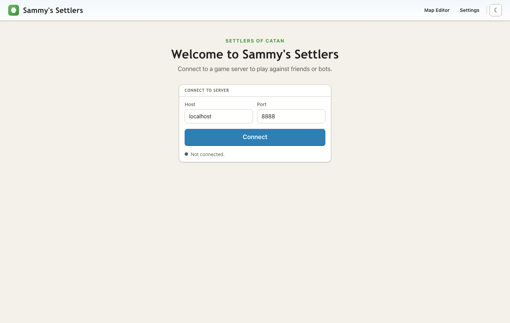
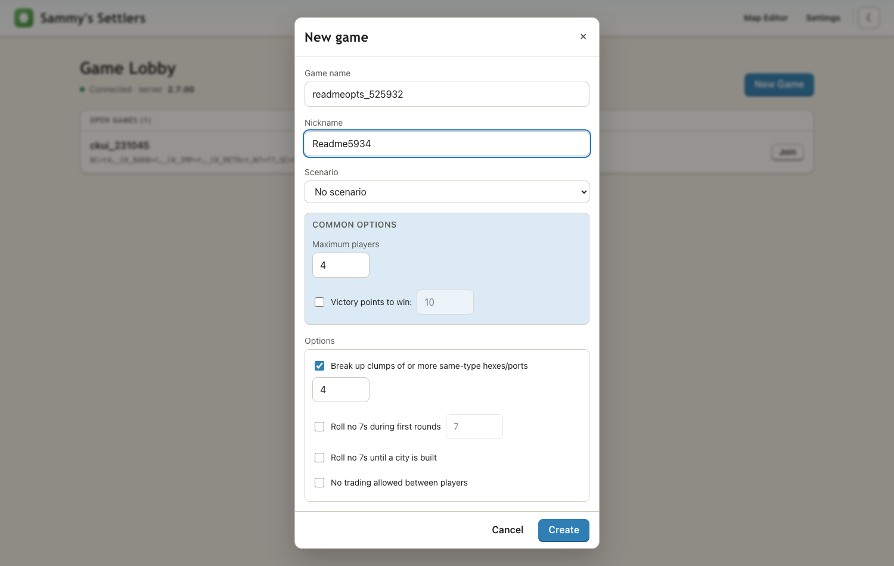
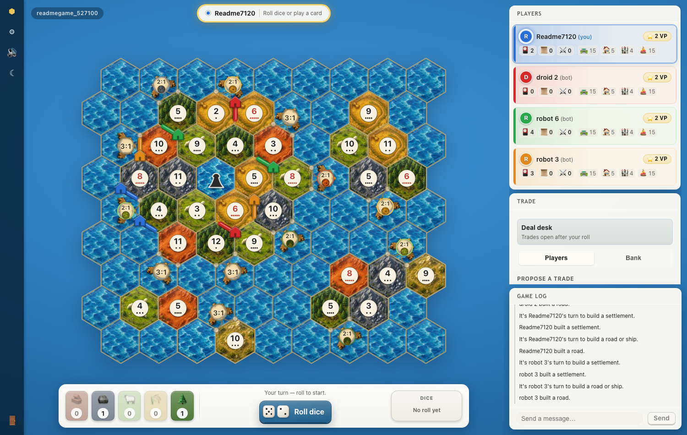
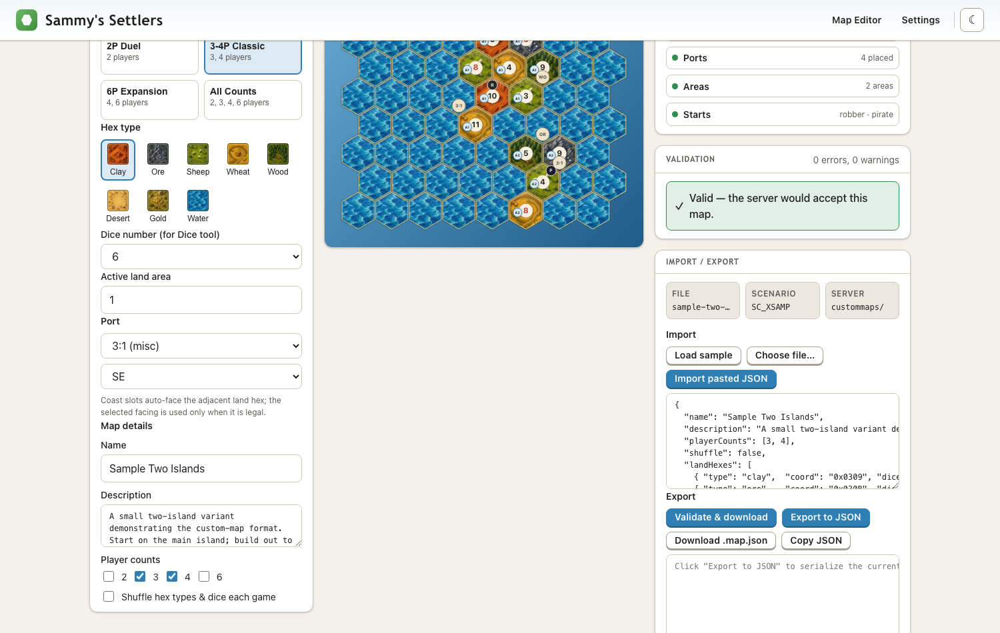

#  Sammys-Settlers

A client-server version of Settlers of Catan with Java desktop and web clients


## Introduction

Sammys-Settlers is a client-server version of the board game Settlers of Catan.
This system supports games between people and optional "robot" opponents.
It was initially created by Robert S Thomas as a dissertation project about
intelligent agents and real-time decision making.

The original Java desktop client can host a server, connect to dedicated
Sammys-Settlers servers over the net, or play practice games offline against bots.
This repository now also includes a modern webapp in [`web/`](web/README.md):
a TypeScript / React / SVG client that connects to the same Java `SOCServer`
over WebSocket and speaks the existing `SOCMessage` protocol.

The Java server remains authoritative for game state, rules, robot players,
scenarios, and custom-map validation. The webapp replaces only the front end.
It is a working in-development client, not yet a full replacement for the Java
Swing client.

The server can optionally use a database to store player account
information and game stats (details below).  A client java app to
create user accounts is also provided.

If you're upgrading from an earlier version of Sammys-Settlers: Check
[doc/Versions.md](doc/Versions.md) for new features, bug fixes, and
config changes, then see **Upgrading from an earlier version** section
of this Readme.

Sammys-Settlers is an open-source project licensed under the GPL. The
project is hosted at https://github.com/samuelih/Sammys-Settlers/ and
https://nand.net/jsettlers/devel/ . Questions, bugs, and pull requests
can be posted at its github page.

\- The Sammys-Settlers Development Team


## Contents

-  Screenshots
-  Documentation
-  Requirements
-  Client Command Line
-  Web Client
-  Hosting the Webapp for Friends
-  Server Setup and Testing
-  Shutting down the server
-  Installing a Sammys-Settlers Server
-  Upgrading from an earlier version
-  Security and Admin Users
-  Development and Building Sammys-Settlers


## Screenshots

Web connect screen:


Web new-game options:


Web sea-board game against bots:


Web custom map editor:



## Documentation

User documentation for game play is available as .html pages located
in the `src/site/users` directory. These can be put on a web server for
its users to access with a browser.

Currently, this Readme and the `doc` directory are the only technical
documentation for running the client or server, setup and other issues.
Over time, more docs will be written. If you are interested in helping
write documentation please contact the development team from our github page.
For developer docs, see [Readme.developer.md](doc/Readme.developer.md).
For the web client, see [`web/README.md`](web/README.md),
[`web/docs/ARCHITECTURE.md`](web/docs/ARCHITECTURE.md), and
[`web/docs/protocol.md`](web/docs/protocol.md).

If you downloaded a Sammys-Settlers JAR file without attached documentation,
the official location of this Readme and the docs is online at
https://github.com/samuelih/Sammys-Settlers/blob/main/Readme.md .


## Requirements

To play Sammys-Settlers you will need either Java Runtime (JRE) version 8
from https://java.com/download/ , or the Java Development Kit (JDK)
version 8 or higher from https://jdk.java.net/ .

Then download Sammys-Settlers-full.jar from either
https://github.com/samuelih/Sammys-Settlers/releases or https://nand.net/jsettlers/
and run it.

To host a Sammys-Settlers server, use any server OS and hosting provider you like.
To also provide a download for the full Jar, you will need any web server
such as [nginx](https://nginx.org/) or [Apache httpd](https://httpd.apache.org).

The Sammys-Settlers-full.jar file can also run locally as a server, without needing a
web server. If you're running a LAN game for friends, that Jar is all you need.

To build Sammys-Settlers from source, you will need Java JDK 8 or higher, and either
gradle 6.9.x or 7.x, or an IDE such as Eclipse which understands gradle's format.
See [doc/Readme.developer.md](doc/Readme.developer.md) for details.

To run or build the web client from source, you will also need Node.js/npm.
The webapp is built with TypeScript, React 18, and Vite 5.


## Client Command Line

Running the client with no parameters is the same as double-clicking it:  
`java -jar Sammys-Settlers-full.jar` will bring up a window with options to
connect to a server, practice against bots (no network needed), or start
a server for others to connect to.

To connect directly to a server, give its host and port number:  
`java -jar Sammys-Settlers-full.jar myserver.example.com 8880`

If your screen is High-DPI, Sammys-Settlers should automatically detect that
instead of running in a very small window. If detection fails for some
reason, ask for High-DPI support this way:  
`java -Djsettlers.uiScale=2 -jar Sammys-Settlers-full.jar`

Also available: `--help`, `--version`, and various debugging flags
listed in [doc/Readme.developer.md](doc/Readme.developer.md).


## Web Client

The web client lives in [`web/`](web/README.md). It is a browser app built with
TypeScript, React, Zustand, Vite, and SVG board rendering. It connects to
`SOCServer` through an additive WebSocket listener. Each WebSocket text frame
carries one existing `SOCMessage` string, so the server, rules engine, robot
subsystem, and Java desktop client continue to work as before.

What works today:

- Connect to a WebSocket-enabled Java server, complete the version/features
  handshake, and enter the lobby.
- Create games with discovered server options and scenarios, sit, lock seats,
  start games, and play against built-in bots.
- Play a sea-board game through the core loop: initial placement, dice rolls,
  building, trade, development cards, robber/pirate movement, discard prompts,
  chat, and game-over scoring.
- Exercise a server-backed Cities & Knights slice, including commodities,
  city improvements, barbarian state, progress-card flows, and a reference
  sidebar for official expansion components.
- Use Settings for theme, color-blind palettes, sound, render quality, and
  font scale.
- Use the standalone Map Editor to author custom `.map.json` sea boards, validate
  them live in the browser, export them, and round-trip them through the Java
  `CustomMapValidator`.

Important current limits:

- The web renderer targets `SOCBoardLarge` sea boards. The classic 4-player
  board coordinate system is not rendered yet.
- The Java Swing client remains the full-featured client. The web client does
  not yet have account management, persistence, reconnect-into-running-game,
  lobby/channel chat, full spectator UX, or every scenario-specific UI.
- Cities & Knights support is intentionally incomplete where the Java server
  does not expose a matching action yet.

Run it locally from a clean checkout:

```bash
gradle assemble
web/scripts/start-test-server.sh    # TCP 8881, WebSocket 8888, 7 bots

cd web
npm install
npm run dev                         # http://localhost:5173
```

Open `http://localhost:5173`, connect to host `localhost` and port `8888`, then
create a game. The Map Editor is available from the app header and does not
require a server connection.

Useful web commands:

```bash
cd web
npm run build
npm test
npx playwright test
```

The Playwright tests need a live Java server on WebSocket port `8888`. The map
validator proof for exported custom maps is:

```bash
web/scripts/validate-map.sh path/to/exported.map.json
```

See [`web/README.md`](web/README.md) for the full run/test workflow and current
scope notes.


## Hosting the Webapp for Friends

The browser version has two network-facing parts:

- A static webapp: the built files from `web/dist/`, served by nginx, Caddy,
  Apache, Docker's bundled nginx, or another plain HTTP server.
- A WebSocket game port: the Java `SOCServer` started with
  `jsettlers.websocket.port`, usually `8888` in this repo's examples.

The Java desktop client can also connect to the same server through the normal
TCP game port, usually `8880`. Browser players use the WebSocket port instead.

The simplest one-machine deployment is Docker:

```bash
docker compose up --build -d
```

That builds the Java server and React app, serves the webapp on port `8080`,
starts the normal TCP server on `8880`, and starts the browser WebSocket listener
on `8888`. The same setup without Compose is:

```bash
docker build -t sammys-settlers-web .

docker run -d \
  --name sammys-settlers \
  -p 8080:8080 \
  -p 8888:8888 \
  -p 8880:8880 \
  -e JS_BOTS=7 \
  -e JS_MAX_CONNECTIONS=50 \
  sammys-settlers-web
```

Open these inbound ports on the server firewall or cloud security group:

- `8080/tcp` for the web page, unless you reverse-proxy it to port `80`.
- `8888/tcp` for browser players.
- `8880/tcp` only if Java desktop clients should connect directly.

If you host from home, also forward those same ports from your router to the
machine running the server. Friends cannot connect to `localhost`; give them
your public DNS name or public IP address.

Give browser players two pieces of information:

```text
Open: http://your-server.example.com:8080
Host: your-server.example.com
Port: 8888
```

They open the URL, enter the host and port on the Connect screen, choose a
nickname, and connect. One player creates a game in the lobby; the others join
that game, sit in open seats, and press Start Game when everyone is ready. Built-in
bots fill empty seats if they are enabled.

For a manual source checkout instead of Docker:

```bash
gradle assemble

cd web
npm install
npm run build
cd ..

gradle runServer -PsocArgs='-Djsettlers.websocket.port=8888 -Djsettlers.startrobots=7 8880 50'
```

Then serve `web/dist/` with your web server. For a quick private test:

```bash
python3 -m http.server 8080 --directory web/dist
```

For a downloaded/built server JAR, run it from a directory containing
`Sammys-SettlersServer.jar`, `gson.jar`, `Java-WebSocket-1.5.6.jar`, and
`slf4j-api-2.0.6.jar`:

```bash
java -jar Sammys-SettlersServer.jar \
  -Djsettlers.websocket.port=8888 \
  -Djsettlers.startrobots=7 \
  8880 50
```

For a public server, do not enable the `debug` user. The development helper
`web/scripts/start-test-server.sh` intentionally enables it for automated tests,
so use Docker, `gradle runServer`, or the JAR command above for a real game.

The current Connect screen always opens `ws://HOST:PORT`. Serve the webapp over
HTTP for now, or add `wss://` support before putting the page behind HTTPS-only
hosting; browsers usually block a plain WebSocket from an HTTPS page.

See [`doc/Web-Docker.md`](doc/Web-Docker.md) for the Docker-specific deployment
notes.


## Server Setup and Testing

From the command line, make sure you are in the Sammys-Settlers distribution
directory which contains both `Sammys-Settlers.jar`, `Sammys-SettlersServer.jar` and the
`lib` directory.  (If you have downloaded `jsettlers-2.x.xx-full.tar.gz`,
look in the /target directory for these files.)

If you have downloaded `jsettlers-2.x.xx-full.jar` or `jsettlers-2.x.xx-server.jar`
instead of the full tar.gz, use that filename on the command lines shown below.

### Server Startup

Start the server with the following command
(server requires Java JDK 8 or higher, or JRE version 8):

    java -jar Sammys-SettlersServer.jar

This will start the server on the default port of `8880` with 7 robots.
It will try to connect to an optional mysql database named `socdata`; startup
will continue even if there is no DB or the DB connect doesn't work.

You can change those values and specify game option defaults; see details below.

To automatically start the Sammys-Settlers server on a linux server, see [src/main/bin/jsettlers.service](src/main/bin/jsettlers.service).

If MySQL or another database is not installed and running (See "Database Setup"
in [doc/Database.md](doc/Database.md)), you will see a warning with the
appropriate explanation:

    Warning: No user database available: ....
    Users will not be authenticated.

The database is not required: Without it, the server will function normally
except that user accounts cannot be maintained.

If you do use the database, you can give users a nickname and password to use
when they log in and play.  People without accounts can still connect, by
leaving the password field blank, as long as they aren't using a nickname
which has a password in the database.  Optionally game results and stats can
also be saved in the database, see next section; those aren't saved by default.

### Parameters and game option defaults:

Sammys-Settlers options, parameters, and game option defaults can be specified on the
command line, or in a `jsserver.properties` file in the current directory when
you start the server.

Command line example:

    java -jar Sammys-SettlersServer.jar -Djsettlers.startrobots=9 8880 50

In this example the parameters are: Start 9 bots; TCP port number 8880;
max clients 50.

The started robots count against your max simultaneous connections (50 in this
example).  If the robots leave less than 6 player connections available, or if
they take more than half the max connections, a warning message is printed at
startup. To start a server with no robots (human players only), use

    -Djsettlers.startrobots=0

Any command-line switches and options go before the port number if specified
on the command line.  If the command includes -jar, switches and options go
after the jar filename.

To change a Game Option from its default, for example to activate the house rule
"Robber can't return to the desert" and set default Victory Points to Win to 13,
use `-o` switches with the game options' names and values, or equivalently
"-Djsettlers.gameopt." + the names and values:

    -o RD=t -o VP=t13
    -Djsettlers.gameopt.RD=t -Djsettlers.gameopt.VP=t13

If a default VP is set, that will also be the minimum winning VP for any scenario.
Some scenarios like Cloth Trade may have a higher VP amount, but none will be lower.
To use the default VP in all scenarios, even those specifying a higher VP amount,
also set game option `_VP_ALL=t` when starting the server.

You could also set a default game scenario this way; for example if your server
was running a tournament of Fog Islands games:

    -o SC=SC_FOG

If the scenario's game options conflict with any other game options given,
a warning will be printed during startup.  In general, servers shouldn't
set a default scenario; users can choose a scenario on their own if they want.

To have all completed games' results saved in the database, use this option:

    -Djsettlers.db.save.games=Y

To see a list of all jsettlers options (use them with -D), run:

    java -jar Sammys-SettlersServer.jar --help

This will print all server options, and all Game Option default values. Note the
format of those default values: Some options need both a true/false flag and a
numeric value. To change the default winning Victory Points to 12 for example:

    -o VP=t12


### Savegame optional feature:

The server can save/load most games to files kept on the server, using admin commands.
For details see [doc/Readme.developer.md](doc/Readme.developer.md): Search for "Saving and loading games"


### jsserver.properties:

Instead of a long command line, any option can be added to `jsserver.properties`
which is read at startup if it exists in the current directory.  Any option
given on the command line overrides the same option in the properties file.
Comment lines start with # .  See `src/main/bin/jsserver.properties.sample` for full
descriptions of all available properties. (Also available online at
https://raw.githubusercontent.com/samuelih/Sammys-Settlers/main/src/main/bin/jsserver.properties.sample).


This example command line

  java -jar Sammys-SettlersServer.jar -Djsettlers.startrobots=9 -o RD=t 8880 50 socuser socpass

is the same as jsserver.properties with these contents:

    jsettlers.startrobots=9
    jsettlers.gameopt.RD=t
    jsettlers.port=8880
    jsettlers.connections=50
    # db user and pass are optional
    jsettlers.db.user=socuser
    jsettlers.db.pass=socpass

To determine if the server is reading the properties file, look for this text
near the start of the console output:

    Reading startup properties from jsserver.properties

To check the syntax and values of a `jsserver.properties file`, use the `-t` or
`--test-config` command line parameter for Config Validation Mode:

    java -jar Sammys-SettlersServer.jar --test-config

This will test and print all configured values and then exit with return code 0
if no problems are found, nonzero otherwise. Output will include a summary line
such as:

    * Config Validation Mode: No problems found.

### Connect a client

Now, double-click Sammys-Settlers.jar to launch the client.  If you'd
prefer to start the player client from another command line window,
use the following command:

    java -jar Sammys-Settlers.jar

Optionally you can also provide the server's name and port, to skip
the Connect To Server dialog:

    java -jar Sammys-Settlers.jar localhost 8880

When the client launches, click Connect To Server. Leave the Server
name field blank to connect to your own computer (localhost) and use
the Sammys-Settlers server you started up in the previous section.

Once you've connected, enter any name in the Nickname field and
create a new game.

Type `*STATS*` into the chat part of the game window.  You should see
something like the following in the chat display:

    * > Uptime: 0:0:26
    * > Total connections: 1
    * > Current connections: 1
    * > Total Users: 1
    * > Games started: 0
    * > Games finished: 0
    * > Total Memory: 2031616
    * > Free Memory: 1524112
    * > Version: 1100 (1.1.00) build JM20080808

Now click on the "Sit Here" button and press "Start Game".  The robot
players should automatically join the game and start playing.

To play again with the same game options and players, click "Quit", then "Reset Board".
If other people are in the game, they will be asked to vote on the reset; any player can
reject it. If bots are in your game, and you want to reset with fewer or no bots, click
the bot's Lock button before clicking Quit/Reset and it won't rejoin the reset game.

If you want other people to access your server, tell them your server address
and port number (the default is 8880).  They can run the Sammys-Settlers.jar file by
itself, and it will bring up a window to enter your server address (DNS name
or IP) and port number.  Or, they can enter the following command:

    java -jar Sammys-Settlers.jar <server_address> <port_number>

Browser players use the separate WebSocket port, not this TCP port. See
**Hosting the Webapp for Friends** for the web URL, firewall, and Connect screen
values to give them.

If you would like to maintain accounts for your Sammys-Settlers server, start the
database prior to starting the Sammys-Settlers Server. See the "Database Setup"
section of [doc/Database.md](doc/Database.md) for directions.

### Server shutdown

To shut down the server hit `Ctrl-C` in its console window, or connect as the
optional debug user and enter `*STOP*` in the chat area of a game window.
This will stop the server and all connected clients will be disconnected.
(See [doc/Readme.developer.md](doc/Readme.developer.md) if you want to set up
a debug user.)

### Installing a Sammys-Settlers server

#### Checklist:

- If using the optional database, start MariaDB, MySQL, or PostgreSQL server  
  (file-based sqlite is another lightweight DB option)
- Copy and edit `jsserver.properties` (optional)
- Start Sammys-Settlers Server
- Start web server (optional)
- Copy `Sammys-Settlers.jar` client JAR and `src/site/*.html` to a web-served directory (optional)

#### Details:

If you want to maintain user accounts or save scores of all completed games,
all of which is optional, you will need to set up a MariaDB, MySQL, PostgreSQL,
or SQLite database. If you will be using a non-SQLite database, be sure to start
the database server software before installing Sammys-Settlers. For DB setup details
see the "Database Setup" section of [doc/Database.md](doc/Database.md)
(available online at https://github.com/samuelih/Sammys-Settlers/blob/main/doc/Database.md).

To install a Sammys-Settlers server, start the server as described in "Server Setup
and Testing". Remember that you can set server parameters and game option
default values with a `jsserver.properties` file: Copy the sample file
`src/main/bin/jsserver.properties.sample` to the same directory as `Sammys-SettlersServer.jar`,
rename it to `jsserver.properties`, and edit properties as needed.
For more details see the **jsserver.properties** section of this Readme.

Remote users can simply start their clients as described there,
and connect to your server's DNS name or IP address.

For browser players, build and serve the webapp and open the WebSocket port as
described in **Hosting the Webapp for Friends**.

To provide a web page where players can download the Jar, you will need to
set up a web server such as nginx or Apache. Alternately, have them download the
full Jar from https://github.com/samuelih/Sammys-Settlers/releases/latest .

If setting up a web server: We assume you have installed the web server
software already, and will refer to `${docroot}` as a directory
to place files to be served by your web server.

Copy `index.html` from `src/site/` to `${docroot}`.  If you're going to use an
accounts database and anyone can register their own account (this is not
the default setting), also copy `accounts.html`.

Edit the html to make sure the port number mentioned in `index.html` and `account.html`
matches the port of your Sammys-Settlers server, and the text starting
"Connect to" has the right server name. If you're using `account.html`, also
un-comment `index.html`'s link to `account.html`.

Next copy the `Sammys-Settlers.jar` full client file to `${docroot}`. This will allow users
to download it to connect from their computer.
(If you've downloaded it as `Sammys-Settlers-{version}-full.jar`, rename it to `Sammys-Settlers.jar`.)

Your web server directory structure should now contain:

    ${docroot}/index.html
    ${docroot}/account.html (optional)
    ${docroot}/Sammys-Settlers.jar

Users should now be able to visit your web site to download the Sammys-Settlers client.

### Upgrading from an earlier version

If you're doing a new installation, not upgrading a server that's
already been running Sammys-Settlers, skip this section.

It's a simple process to upgrade to the latest version of Sammys-Settlers:

- Read this readme's "Requirements" section, in case the minimum java version
  or another requirement has changed
- Read [doc/Versions.md](doc/Versions.md) for new features, bug fixes, and
  config changes made from your version to the latest version.  Occasionally
  defaults change and you'll need to add a server config option to keep the
  same behavior, so read carefully.
- If using the applet: When upgrading from 1.x to 2.x, the applet class name changes
  from `soc.client.SOCPlayerClient` to `soc.client.SOCApplet`,
  so update the applet tag in your download page html.
  (Most people and most browsers don't use the applet anymore.)
- If you're using the optional database, backup the database and see
  the "Upgrading from an earlier version" section of [doc/Database.md](doc/Database.md)
  for parameter changes and other actions to take.
- Save a backup copy of your current Sammys-Settlers.jar and Sammys-SettlersServer.jar,
  in case you want to run the old version for any reason.
- Stop the old server
- Copy the new Sammys-Settlers.jar and Sammys-SettlersServer.jar into place
- Start the new server, including any new options you wanted from [doc/Versions.md](doc/Versions.md)
- If the new server's startup messages include a line about database schema
  upgrade, see the "Upgrading" section of [doc/Database.md](doc/Database.md).
- Test that you can connect and start games as usual, with and without bots.
  When you connect make sure the version number shown in the left side of
  the client window is the new Sammys-Settlers version.


## Security and Admin Users

The server has commands anyone can run by typing into a game's chat window, like `*STATS*` or `*WHO*`.
It also has privileged commands that can be run only by named Admin Users or the `debug` user, like `*GC*` or `*SAVEGAME*`.

The debug user shouldn't be enabled except on a developer's own computer, because of its in-game abilities.
Admin Users let you manage your server without the debug user. They authenticate with passwords
stored in a SQLite file or a database system. To set up Admin Users, see
section "Security, Admin Users, Admin Commands" of [doc/Database.md](doc/Database.md).

Sammys-Settlers does not use `log4j`, and all released versions are not vulnerable to CVE-2021-44228.


## Development and Building Sammys-Settlers

Sammys-Settlers is an open-source project licensed under the GPL. The project
source code is hosted at https://github.com/samuelih/Sammys-Settlers/ and
the project website is https://nand.net/jsettlers/devel/ .  Questions,
bugs, patches, and pull requests can be posted at the github page.

For more information on building or developing Sammys-Settlers, see
[doc/Readme.developer.md](doc/Readme.developer.md). That readme also has
information about translating jsettlers to other languages; see the
"I18N" section.

Sammys-Settlers is licensed under the GNU General Public License.  Each source file
lists contributors by year.  A copyright year range (for example, 2007-2011)
means the file was contributed to by that person in each year of that range.
See individual source files for the GPL version and other details.

The localization into French was contributed in 2020 by Lee Passey using
the [CC0](https://creativecommons.org/publicdomain/zero/1.0/) license,
and further developed by Jeremy Monin under CC0.

BCrypt.java is licensed under the "new BSD" license, and is copyright
(C) 2006 Damien Miller; see BCrypt.java for details.  jBCrypt-0.4.tar.gz
retrieved 2017-05-27 from https://www.mindrot.org/projects/jBCrypt/
and some constants, javadocs, throws declarations added by Jeremy D Monin.

org.fedorahosted.tennera.antgettext.StringUtil is licensed under the
"Lesser GPL" (LGPL) license, and is from the JBoss Ant-Gettext utilities.

Miscellaneous code is attributed to the Strategic Conversation (STAC) Project -
https://www.irit.fr/STAC/ - from their fork published at https://github.com/sorinMD/StacSettlers
and reintegrated into Sammys-Settlers by Jeremy D Monin for v2.5.00.
[The StacSettlers readme](https://github.com/sorinMD/StacSettlers/blob/master/README.md)
says "Copyright (C) 2017  STAC" and that repo's most recent substantial change was in 2018.
In the Sammys-Settlers repository, commits from that code use "STAC Project" as the author.

The classic hex and port images were created by Jeremy Monin, and are licensed
Creative Commons Attribution Share Alike (cc-by-sa 3.0 US) or Creative
Commons Attribution (CC-BY 3.0 US); see each image's gif comments for details.
classic/goldHex.gif is based on a 2010-12-21 CC-BY 2.0 image by Xuan Che,
available at https://www.flickr.com/photos/rosemania/5431942688/ , of
ancient Greek coins.

The pastel hex images were created and contributed by qubodup, (C) 2019,
licensed CC-BY-SA 3.0, and were retrieved 2019-08-17 from
https://github.com/qubodup/pastel-tiles (rendered with that repo's `hex.sh` script).

doc/graf/Logo.svg was created and contributed by Ruud Poutsma, (C) 2017.


This project is a SourceForge Community Choice Award winner (March 2022).
