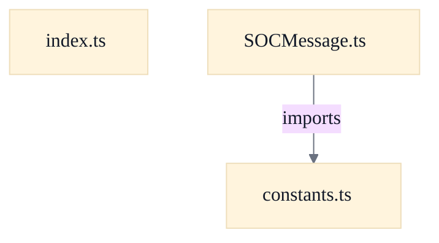

# Browser WebSocket Protocol Bridge

## Strategic Context
- **Non-Java client interoperability** — constants.ts states the values 'mirror the exact wire-format tokens and message-type IDs used by the Java SOCServer so the TypeScript client can interoperate over WebSocket', keeping these in sync with SOCMessage.java. This bridge exists so a browser/React client can speak the existing SOCMessage protocol unchanged rather than introducing a parallel protocol.
- **Behavioral fidelity to the Java dispatch** — SOCMessage.ts is explicitly 'Ported from the dispatch logic in soc.message.SOCMessage.toMsg(String) and the per-class toCmd()/parseDataStr() contract', and decode()'s comments justify each divergence (lenient parseInt, no-SEP case) against Java behavior — the distinctive design goal here is wire-for-wire parity, not merely 'a parser'.

## Overview
Outbound, a UI/store layer constructs a typed SOCMessage and calls encode(), which returns msg.toCmd() — the exact wire command string a Java class would produce, with no transport framing — ready to be sent as one WebSocket text frame. Inbound, a received frame's raw string is passed to decode(): it reads the integer type id as the first SEP-delimited token (mirroring Java's StringTokenizer-based SOCMessage.toMsg), validates it, looks up the per-type parser in the registry, and hands it the remaining data portion. The parser returns a structured SOCMessage or null. Message modules populate the registry at import time via registerParser, bootstrapped through index.ts. Unknown type ids and parser failures both resolve to null, so malformed input is silently ignored rather than throwing into the caller.

## Components
- **SOCMessage core (encode/decode/registry)** (referenced; defined externally): Defines the SOCMessage interface and MessageParser type, owns the type-id→parser registry, and exposes encode(), decode(), registerParser(), and the test-only _clearParsersForTest(). encode() is a thin wrapper over msg.toCmd(); decode() reads the type id up to the first SEP and dispatches to the registered parser.
- **Protocol constants vocabulary** (referenced; defined externally): Mirrors the Java SOCMessage wire vocabulary as `as const` objects and derived code-union types: separators (SEP/SEP2/EMPTYSTR/GAME_NONE), MessageType ids, OptionType/OptionFlag, SeatLockState (+SeatLockWire), GameState, plus markers. Single source of truth for interop with the Java SOCServer.
- **Protocol public surface / parser bootstrap** (referenced; defined externally): Re-exports the core types, constants, and every ported message module. Importing this module triggers each message module's side-effecting registerParser() call so decode() can dispatch to all ported types; also re-exports model helpers (resourceSet, gameOptions).

## Connections
- **Protocol constants vocabulary (constants.ts)** (outbound) — via import { SEP } from './constants' (evidence: web/src/protocol/SOCMessage.ts (import of SEP))
- **Ported message modules (messages/*.ts)** (inbound) — via side-effecting imports that call registerParser at load time (evidence: web/src/protocol/index.ts (re-exports each message module; comment 'each self-registers its parser on import'))
- **Java SOCServer SOCMessage protocol** (bidirectional) — via WebSocket text frames carrying toCmd()/toMsg-compatible command strings (evidence: web/src/protocol/constants.ts header ("interoperate over WebSocket"); web/src/protocol/SOCMessage.ts (ported from soc.message.SOCMessage.toMsg))

## Design Decisions
- **Type-id-first dispatch via a runtime parser registry**: decode() mirrors Java's SOCMessage.toMsg(String): read the type id token, look up a parser, pass it the data tail. This keeps the TypeScript port behaviorally identical to the authoritative Java dispatch switch so both ends agree on framing, rather than inventing a new browser-side message-routing scheme.
- **Parsers self-register through side-effecting module imports**: Each message module calls registerParser at import time, and index.ts imports them all. This decouples the SOCMessage core from the concrete message catalogue — the core never references individual message classes — so new ported messages plug in by being exported from index.ts.
- **Stricter integer validation than JS Number.parseInt**: Number.parseInt is lenient ('1083abc' → 1083) and does not enforce Java's 32-bit signed integer range. decode() applies `parseJavaInt` before dispatch so the browser rejects malformed and out-of-range type tokens exactly as the Java server would, preserving cross-runtime parity.
- **decode() returns null instead of throwing on unknown/garbled input**: Matches Java's toMsg, which ignores unknown types and catches parse errors. Returning null lets the caller skip a frame without crashing the receive loop on an unrecognized or malformed message.
- **Constants as `as const` objects with derived union types, not TS enums**: Values are copied verbatim from the Java source and exposed both as runtime lookups and as literal-union types (e.g. MessageTypeId), giving wire-accurate constants without TS enum runtime/iteration quirks.

## Constraints
- **[UNVERIFIED]** registerParser MUST reject a second parser registration for an already-registered type id (throws to catch accidental duplicate registration). — web/src/protocol/SOCMessage.ts::registerParser (throws `Duplicate parser registration for message type ${type}`) (cross-document reconciliation: not verified against `web/src/protocol/SOCMessage.ts`; recorded as design intent, not current code fact.)
- **[UNVERIFIED]** A decoded type-id token MUST match Java's Integer.parseInt semantics (optional sign + digits only, within signed 32-bit integer range); tokens JS parseInt would leniently accept or round MUST be rejected before dispatch. — web/src/protocol/SOCMessage.ts::decode; web/src/protocol/javaInt.ts::parseJavaInt (cross-document reconciliation: not verified against `web/src/protocol/SOCMessage.ts`; recorded as design intent, not current code fact.)
- **[UNVERIFIED]** decode MUST return null (not throw) for unknown type ids or parser failures, mirroring Java's ignore-unknown-types behavior. — web/src/protocol/SOCMessage.ts::decode (try/catch returns null; undefined-parser branch returns null) (cross-document reconciliation: not verified against `web/src/protocol/SOCMessage.ts`; recorded as design intent, not current code fact.)
- **[SOFT]** Each WebSocket text frame SHOULD carry exactly one toCmd() command string (no transport framing added by encode). — web/src/protocol/constants.ts header comment ("Each WebSocket text frame carries exactly one `toCmd()` string"); hypothesis, not exercised by supplied code

## Non-Functional Requirements
- **error-handling** — decode() must not propagate parser exceptions; any thrown error during parsing resolves to null so the receive loop survives a malformed frame. — web/src/protocol/SOCMessage.ts::decode (try { return parser(data) } catch { return null })
- **reliability** — Parser registry integrity is guarded against duplicate type-id registration, preventing silent dispatch ambiguity at startup. — web/src/protocol/SOCMessage.ts::registerParser
- **observability/testability** — A test-only registry reset (_clearParsersForTest) is provided and intentionally not exported from the package index, enabling isolated registry tests without leaking into the public surface. — web/src/protocol/SOCMessage.ts::_clearParsersForTest

## Examples
*Shows the fail-closed duplicate-registration guard that protects the side-effecting self-registration model.*
*Source: `web/src/protocol/SOCMessage.ts::registerParser`*
```
export function registerParser(type: number, parser: MessageParser): void {
  if (parserRegistry.has(type)) {
    throw new Error(`Duplicate parser registration for message type ${type}`);
  }
  parserRegistry.set(type, parser);
```

*Illustrates the strict integer guard that aligns decode with Java's Integer.parseInt rather than lenient JS parsing.*
*Source: `web/src/protocol/SOCMessage.ts::decode`*
```
const type = parseJavaInt(typeStr);
  if (type === null) {
    return null;
  }
```

## Diagrams
### Dependency



## Source Linkage
- [encode serializes via msg.toCmd()](../../../web/src/protocol/SOCMessage.ts::encode)
- [decode reads type id from first SEP token and dispatches to registered parser](../../../web/src/protocol/SOCMessage.ts::decode)
- [Java-compatible integer parser for type tokens](../../../web/src/protocol/javaInt.ts::parseJavaInt)
- [registerParser throws on duplicate type-id registration](../../../web/src/protocol/SOCMessage.ts::registerParser)
- [Parser registry clearing helper for tests](../../../web/src/protocol/SOCMessage.ts::_clearParsersForTest)
- [Web protocol constants mirror Java message vocabulary](../../../web/src/protocol/constants.ts)
- [Public surface re-exports + parser bootstrap](../../../web/src/protocol/index.ts)
- [Web client dependency surface (react/zustand, ws devDep)](../../../web/package.json)
- [One SOCMessage per WebSocket text frame](../../../web/src/protocol/SOCMessage.ts)

Parent scope: [_scope.md](_scope.md)
Sibling feature: [browser-websocket-protocol-bridge.feature.md](browser-websocket-protocol-bridge.feature.md)
Scope architecture: [server-message-protocol.arch.md](server-message-protocol.arch.md)

## Source Linkage Grounding

_Per-row confidence; `_unverified_` rows are disclosed, not verified; `0.08 (resolved, uncited)` is the resolved-but-uncited baseline, not measured evidence._

| Element | Doc Evidence | Code Evidence | Confidence |
|---------|--------------|---------------|-----------:|
| Source Linkage: encode serializes via msg.toCmd() | Base SOCMessage type, parser registry, and encode/decode helpers. | web/src/protocol/SOCMessage.ts:64-66 | 0.75 |
| Source Linkage: decode reads type id from first SEP token and dispatches to registered parser | Base SOCMessage type, parser registry, and encode/decode helpers. | web/src/protocol/SOCMessage.ts:79-112 | 0.75 |
| Source Linkage: Java-compatible integer parser for type tokens | Java-style decimal syntax and signed 32-bit range validation. | web/src/protocol/javaInt.ts | 0.75 |
| Source Linkage: registerParser throws on duplicate type-id registration | Base SOCMessage type, parser registry, and encode/decode helpers. | web/src/protocol/SOCMessage.ts:50-55 | 0.75 |
| Source Linkage: Parser registry clearing helper for tests | Base SOCMessage type, parser registry, and encode/decode helpers. | web/src/protocol/SOCMessage.ts:118-120 | 0.75 |
| Source Linkage: Web protocol constants mirror Java message vocabulary | Protocol constants ported from soc.message.SOCMessage (Java). | web/src/protocol/constants.ts | 0.83 |
| Source Linkage: Public surface re-exports + parser bootstrap | Public surface of the protocol core. | web/src/protocol/index.ts | 0.75 |
| Source Linkage: Web client dependency surface (react/zustand, ws devDep) |  | web/package.json | 0.08 (resolved, uncited) |
| Source Linkage: One SOCMessage per WebSocket text frame | Base SOCMessage type, parser registry, and encode/decode helpers. | web/src/protocol/SOCMessage.ts | 0.75 |

Related scopes: [Quality Infrastructure](../quality-infrastructure/quality-infrastructure.arch.md), [Web Client & Board Rendering](../web-client-board-rendering/web-client-board-rendering.arch.md), [Web Protocol & Map Editor](../web-protocol-map-editor/web-protocol-map-editor.arch.md)
