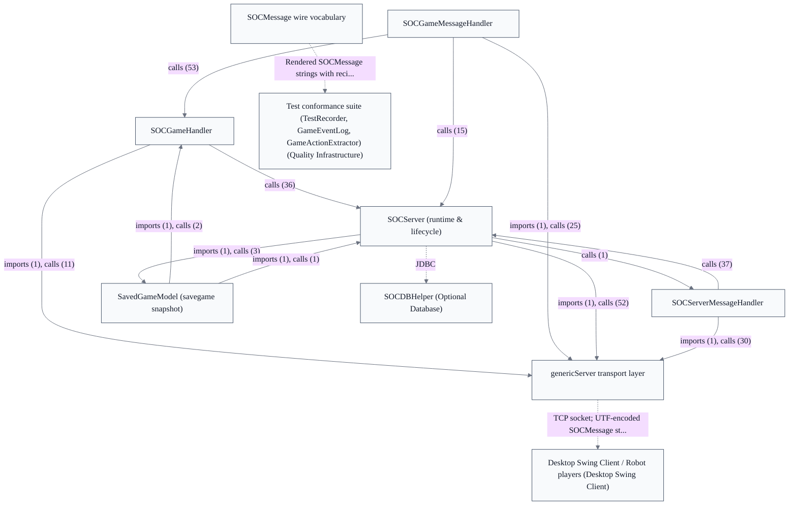

# Server & Message Protocol

## Strategic Context
- **Deliberately simple wire encoding for non-Java interop** — Per the SOCMessage Wire Vocabulary design, messages are encoded as flat strings-and-integers via writeUTF/readUTF rather than Java object serialization specifically so non-Java clients and bots can interoperate — the protocol's simplicity is the interop strategy, not an implementation accident.
- **Additive WebSocket transport preserves server authority** — The WebSocket listener carries exactly one SOCMessage string per text frame so the TypeScript browser client speaks the identical protocol without the server ceding its authority over game state, rules, robots, and scenarios; the browser path is an additional transport, not a second protocol.
- **Three-way dispatch split anticipating future game types** — Inbound dispatch is split across lobby/connection (SOCServerMessageHandler), in-game actions (SOCGameMessageHandler), and per-game glue (SOCGameHandler) deliberately so future game *types* could each extend a GameHandler — the seam is a planned extensibility point, and the in-game handler's false-on-unknown default keeps that boundary tolerant.
- **Compatibility via tolerant parsing, not versioned formats** — Backward/forward compatibility is achieved through value remapping, tolerant parsing, and an extensible named Layout Parts map (SOCBoardLayout2) plus parallel-array element messages — explicitly chosen over versioned message formats, which keeps mixed-version clients and bots on one vocabulary.

## Overview
Server Runtime & Request Dispatch: SOCServer is the long-running process that extends the generic Server, listens on TCP 8880 plus an optional WebSocket port (started by serverUp() via WebSocketServerBridge), and accepts human and robot clients alike. Inbound SOCMessages are marshalled through an InboundMessageQueue and routed by SOCMessageDispatcher three ways — SOCServerMessageHandler (lobby/connection), SOCGameMessageHandler (in-game actions, whose dispatch() returns false for unrecognized types), and SOCGameHandler (per-game glue, designed so future game types each extend a GameHandler). The server stays authoritative for full game state; clients hold only partial state, and both transports share one dispatch pipeline. SOCMessage Wire Vocabulary: the soc.message package is the single source of truth for the client-server wire vocabulary — one class per message type owning that action's typed fields. Sending serializes fields to a flat numeric-type-ID-prefixed string via toCmd() and writeUTF (in-JVM bots use StringConnection and skip UTF coding); receiving uses a central toMsg() switch over the type-ID registry. Design choices favor strings-and-integers encoding over Java serialization, an extensible named Layout Parts map (SOCBoardLayout2) and parallel-array element messages (SOCGameElements/SOCPlayerElements) over fixed field lists, backward/forward compatibility via value remapping and tolerant parsing rather than versioned formats, and a human-readable toString() that must itself round-trip (since v2.5.00). Browser WebSocket Protocol Bridge (web side owned by Web Protocol & Map Editor epic): a UI/store layer builds a typed SOCMessage and calls encode(), which returns msg.toCmd() — the exact Java wire string with no transport framing — sent as one WebSocket text frame. Inbound, decode() reads the integer type id as the first SEP-delimited token (mirroring Java's StringTokenizer-based toMsg), validates it with Java-style decimal syntax and signed 32-bit range checks, looks up a per-type parser in a runtime registry (parsers self-register via side-effecting imports), and returns null instead of throwing on unknown/garbled input. Constants are `as const` objects with derived union types rather than TS enums. Game-Action Message Sequences (test harness owned by Quality Infrastructure epic): the executable conformance layer that pins the multi-message protocol documented in doc/Message-Sequences-for-Game-Actions.md. TestRecorder starts a RecordingSOCServer on a stringport, loads a SavedGameModel fixture, drives real actions through a displayless client, and reads back the per-game GameEventLog; compareRecordsToExpected asserts captured wire messages (tagged by audience) as rendered strings with recipient prefixes rather than by object equality. Client→server recording is off by default, logs normalize to the en_US fallback, and the suite exercises unknown-sequence recovery and interleaved non-protocol entries.

## Components
- **SOCServer (runtime & lifecycle)**: serverUp() bootstrap; listening on TCP SOC_PORT_DEFAULT 8880 and, when PROP_JSETTLERS_WEBSOCKET_PORT is set, an additional WebSocket port; accepting both human and robot connections; resolving known game options before a game starts.
- **genericServer transport layer**: Connection abstraction, inbound queueing, and dispatch routing; isolates the rest of the server from whether a client arrived over a socket or a WebSocket. Server-launched bots use an in-JVM StringConnection on the same path.
- **SOCServerMessageHandler**: Routing pre-game and out-of-game messages to lobby/connection logic.
- **SOCGameMessageHandler**: Classifying and routing in-game SOCMessages; tolerant default case for unknown types.
- **SOCGameHandler**: Applying dispatched actions against SOCGame/SOCPlayer and composing the per-action outbound message sequences.
- **SOCMessage wire vocabulary**: Defining and (de)serializing every protocol message; remains transport-independent so both the socket and WebSocket paths reuse it verbatim.
- **SavedGameModel (savegame snapshot)**: Serializing and rehydrating a SOCGame as JSON for dev/test setup of board states.

## Boundaries
- **SOCServer (runtime & lifecycle)** boundary: The single long-running process and entry point: owns server bootstrap, connection acceptance, and the authoritative registry of which games exist (SOCGameListAtServer). It accepts traffic and resolves game options/scenarios at game-creation time, but delegates every rule decision downstream — it never applies a move itself.
- **genericServer transport layer** boundary: The transport-neutral seam between raw sockets and message dispatch. Inbound frames from either a plain TCP socket or the WebSocketServerBridge are marshalled onto one InboundMessageQueue and routed by SOCMessageDispatcher, so all message handling is transport-agnostic — the two transports share a single pipeline. _[unverified: no imports/calls edge src/main/java/soc/server/genericServer/Connection.java::Connection; SOCServerMessageHandler -> Connection (calls x30); SOCGameMessageHandler -> Connection (calls x25) -> WebSocketServerBridge, src/main/java/soc/server/genericServer/Connection.java::Connection; SOCServerMessageHandler -> Connection (calls x30); SOCGameMessageHandler -> Connection (calls x25) -> InboundMessageQueue in code graph]_
- **SOCServerMessageHandler** boundary: Owns connection- and lobby-level handling — version negotiation, authentication, channels, and join/sit/start — i.e. everything before a player is acting inside a game. Acts against SOCServer state, not the game model.
- **SOCGameMessageHandler** boundary: Owns dispatch of in-game player actions. Its dispatch() returns false for unrecognized or non-game message types rather than erroring, and it forwards per-game work to SOCGameHandler. The edge here is action routing only — validation and state change live below it.
- **SOCGameHandler** boundary: Owns the per-game logic glue between dispatch and the authoritative model, structured so future game *types* would each extend a GameHandler base. Translates validated actions into model calls and emits the resulting SOCMessage broadcasts; it does not own the rules themselves.
- **SOCMessage wire vocabulary** boundary: Single source of truth for the client⇄server wire vocabulary (soc.message): one class per message type owns that action's typed fields, serializing via toCmd() — a numeric type-ID prefix plus a flat unicode string — and parsing via the central toMsg() type-ID switch. Owns the extensible named-Layout-Parts map (SOCBoardLayout2) and parallel-array element messages (SOCGameElements / SOCPlayerElements), plus a human-readable toString() that must itself round-trip.
- **SavedGameModel (savegame snapshot)** boundary: Owns JSON snapshot/restore of full game state for the debug *SAVEGAME* / *LOADGAME* / *RESUMEGAME* commands, reading the authoritative model to serialize it. A server-side persistence boundary distinct from the optional account/score database.

## Integration Points
- **Authoritative rule application**: The dispatch handlers (SOCGameMessageHandler, SOCGameHandler) and SOCServer invoke the authoritative game model to validate and apply moves and to read state for outbound messages; the server holds full state while clients hold only partial state. This is the dominant edge in the code graph and is in-process, not networked. — see [Game Model & Rules Engine](../game-model-rules-engine/game-model-rules-engine.arch.md)
- **Game option & scenario resolution**: At game creation SOCServer resolves known game options and scenario rules from the game-model option registry; SOCGameOptionSet.isOptionSet is a high-centrality element consulted to gate behavior. — see [Game Model & Rules Engine](../game-model-rules-engine/game-model-rules-engine.arch.md)
- **Optional persistence**: SOCServer optionally connects to the vendor-neutral account/score/bot-params database; the server runs fully without it (only persistent accounts/stats are lost). SOCDBHelper.connect is the entry to this delegated subsystem. — see [Optional Database](../optional-database/optional-database.arch.md)
- **Desktop & robot client connections**: Human desktop clients and built-in/robot clients connect over the same SOCMessage path; the client send side is ClientNetwork.putNet/putPractice and robots use SOCDisplaylessPlayerClient (whose destroy() tears the connection down). The transport layer accepts these and feeds the dispatch pipeline. — see [Desktop Swing Client](../desktop-swing-client/desktop-swing-client.arch.md)
- **Browser WebSocket protocol bridge**: The additive WebSocketServerBridge carries exactly one SOCMessage wire string per WebSocket text frame, letting the TypeScript browser client speak the existing protocol with no change to server authority. The browser side mirrors toCmd()/toMsg() in web/src/protocol/SOCMessage.ts (type-id-first decode, parser registry); that web protocol layer is owned by the Web Protocol & Map Editor epic. — see [Web Protocol & Map Editor](../web-protocol-map-editor/web-protocol-map-editor.arch.md)
- **Protocol conformance recording**: The recognized network sequences for each game action (doc/Message-Sequences-for-Game-Actions.md) are exercised by the test suite: a RecordingSOCServer captures the per-game GameEventLog of rendered wire messages (each tagged by audience), and GameActionExtractor.next walks them. compareRecordsToExpected asserts on rendered message strings with recipient prefixes. The harness and SnippingTextArea it drives are owned by the Quality Infrastructure / desktop-client epics; this epic produces the wire messages under test. — see [Quality Infrastructure](../quality-infrastructure/quality-infrastructure.arch.md)

## Diagrams
### Architecture

## Source Linkage
- [SOCServer (runtime, dispatch entry, listening ports)](../../../src/main/java/soc/server/SOCServer.java::SOCServer)
- [SOCServerMessageHandler (lobby/connection dispatch)](../../../src/main/java/soc/server/SOCServerMessageHandler.java::SOCServerMessageHandler)
- [SOCGameMessageHandler (in-game action dispatch)](../../../src/main/java/soc/server/SOCGameMessageHandler.java::SOCGameMessageHandler)
- [SOCGameHandler (per-game glue)](../../../src/main/java/soc/server/SOCGameHandler.java::SOCGameHandler)
- [SOCMessage wire encoding via toCmd/toMsg and writeUTF/readUTF](../../../src/main/java/soc/message/SOCMessage.java::SOCMessage)
- [SOCBoardLayout2 named Layout Parts message](../../../src/main/java/soc/message/SOCBoardLayout2.java::SOCBoardLayout2)
- [SOCGameElements parallel-array element message](../../../src/main/java/soc/message/SOCGameElements.java::SOCGameElements)
- [SOCPlayerElements parallel-array element message](../../../src/main/java/soc/message/SOCPlayerElements.java::SOCPlayerElements)
- [SOCServerPing message](../../../src/main/java/soc/message/SOCServerPing.java::SOCServerPing)
- [genericServer Connection / transport seam](../../../src/main/java/soc/server/genericServer/Connection.java::Connection)
- [Server game registry](../../../src/main/java/soc/server/SOCGameListAtServer.java::SOCGameListAtServer)
- [SavedGameModel JSON snapshot/restore](../../../src/main/java/soc/server/savegame/SavedGameModel.java::SavedGameModel)
- [Browser WebSocket protocol bridge (cross-epic, web side)](../../../web/src/protocol/SOCMessage.ts)
- [Optional database connect (cross-epic)](../../../src/main/java/soc/server/database/SOCDBHelper.java::SOCDBHelper.connect)
- [Listening ports (8880 TCP, optional WebSocket, 8080 web)](../../../Dockerfile)

Parent scope: [_scope.md](_scope.md)

## Source Linkage Grounding

_Per-row confidence; `_unverified_` rows are disclosed, not verified; `0.08 (resolved, uncited)` is the resolved-but-uncited baseline, not measured evidence._

| Element | Doc Evidence | Code Evidence | Confidence |
|---------|--------------|---------------|-----------:|
| Source Linkage: SOCServer (runtime, dispatch entry, listening ports) |  | src/main/java/soc/server/SOCServer.java:1676-1687 | 0.83 |
| Source Linkage: SOCServerMessageHandler (lobby/connection dispatch) |  | src/main/java/soc/server/SOCServerMessageHandler.java:106-112 | 0.83 |
| Source Linkage: SOCGameMessageHandler (in-game action dispatch) |  | src/main/java/soc/server/SOCGameMessageHandler.java:100-104 | 0.83 |
| Source Linkage: SOCGameHandler (per-game glue) |  | src/main/java/soc/server/SOCGameHandler.java:311-315 | 0.83 |
| Source Linkage: SOCMessage wire encoding via toCmd/toMsg and writeUTF/readUTF |  | src/main/java/soc/message/SOCMessage.java:165-1399 | 0.83 |
| Source Linkage: SOCBoardLayout2 named Layout Parts message |  | src/main/java/soc/message/SOCBoardLayout2.java:222-246 | 0.40 |
| Source Linkage: SOCGameElements parallel-array element message |  | src/main/java/soc/message/SOCGameElements.java:314-318 | 0.16 |
| Source Linkage: SOCPlayerElements parallel-array element message |  | src/main/java/soc/message/SOCPlayerElements.java:153-187 | 0.16 |
| Source Linkage: SOCServerPing message |  | src/main/java/soc/message/SOCServerPing.java:65-69 | 0.24 |
| Source Linkage: genericServer Connection / transport seam |  | src/main/java/soc/server/genericServer/Connection.java:65-517 | 0.75 |
| Source Linkage: Server game registry |  | src/main/java/soc/server/SOCGameListAtServer.java:113-130 | 0.75 |
| Source Linkage: SavedGameModel JSON snapshot/restore |  | src/main/java/soc/server/savegame/SavedGameModel.java:473-532 | 0.75 |
| Source Linkage: Browser WebSocket protocol bridge (cross-epic, web side) | Base SOCMessage type, parser registry, and encode/decode helpers. | web/src/protocol/SOCMessage.ts | 0.75 |
| Source Linkage: Optional database connect (cross-epic) |  | src/main/java/soc/server/database/SOCDBHelper.java:1201-1224 | 0.75 |
| Source Linkage: Listening ports (8880 TCP, optional WebSocket, 8080 web) | syntax=docker/dockerfile:1 | Dockerfile | 0.08 (resolved, uncited) |

Related scopes: [Desktop Swing Client](../desktop-swing-client/desktop-swing-client.arch.md), [Game Model & Rules Engine](../game-model-rules-engine/game-model-rules-engine.arch.md), [Optional Database](../optional-database/optional-database.arch.md), [Quality Infrastructure](../quality-infrastructure/quality-infrastructure.arch.md), [Robot / AI Players](../robot-ai-players/robot-ai-players.arch.md), [Web Client & Board Rendering](../web-client-board-rendering/web-client-board-rendering.arch.md), [Web Protocol & Map Editor](../web-protocol-map-editor/web-protocol-map-editor.arch.md)
