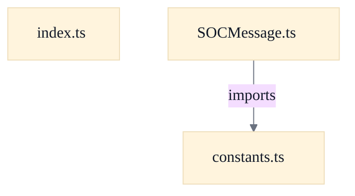
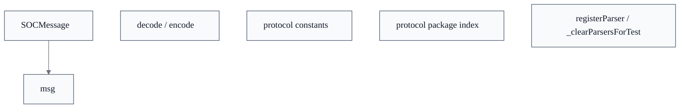

# Server Protocol & WebSocket Connectivity

## Strategic Context
- **Java-interop is the reason the layer exists** — constants.ts states these tables 'mirror the exact wire-format tokens and message-type IDs used by the Java SOCServer so the TypeScript client can interoperate over WebSocket' — the protocol layer's purpose is to let a browser client speak the existing Java protocol unchanged, rather than introduce a new transport.
- **One toCmd() string per frame** — Per constants.ts, 'Each WebSocket text frame carries exactly one toCmd() string' — this framing decision (one message per frame, no transport-level framing inside encode/decode) is what keeps the TS encode/decode contract symmetric and lets it reuse the Java per-class toCmd()/parseDataStr() shape directly.

## Overview
This feature is the browser client's protocol layer for speaking the Java SOCServer wire protocol over WebSocket. Outbound, a message object is serialized via encode(msg) → msg.toCmd(), producing one command string per WebSocket text frame. Inbound, decode(raw) splits the raw frame on the SEP separator, parses the leading token as a Java-compatible signed 32-bit integer message-type id, looks that id up in a module-level parser registry, and dispatches the remaining data portion to the matching MessageParser; it returns null for a missing separator-only type, an unknown id, a non-integer/out-of-range token, or a parser that rejects garbled data. The registry is populated lazily: importing web/src/protocol/index.ts triggers each ported message module's self-registration through registerParser. Shared constant tables in constants.ts supply the type ids and enum ordinals every parser and serializer depends on, keeping the TypeScript client byte-compatible with the existing Java server.

## Components
- **SOCMessage**: Defines the SOCMessage interface (readonly numeric `type` + `toCmd()` serialization contract), the per-type parser registry, and the encode/decode entry points. Pure TypeScript, no React.
- **decode / encode** (referenced; defined externally): decode(raw) reads the integer type id up to the first SEP, validates it with the Java-compatible integer helper, looks up a registered parser, and hands it the remaining data portion; encode(msg) is a thin wrapper over msg.toCmd().
- **registerParser / _clearParsersForTest** (referenced; defined externally): registerParser(type, parser) installs a parser keyed by type id and throws on a duplicate id; _clearParsersForTest() resets the registry for test isolation and is intentionally not re-exported from the package index.
- **protocol constants** (referenced; defined externally): Frozen lookup tables (SEP/SEP2/EMPTYSTR, MessageType, StatusValue, SeatLockState/SeatLockWire, OptionType, OptionFlag, GameState, ...) ported verbatim from soc.message.SOCMessage and related Java sources to mirror the exact wire-format tokens and message-type ids.
- **protocol package index** (referenced; defined externally): Public surface of the protocol core; re-exports constants, the SOCMessage contract, and every ported message module. Importing it runs each message module's side-effecting registerParser() call so decode() can dispatch to all ported types.

## Connections
- **Java SOCServer message classes (soc.message.SOCMessage)** (bidirectional) — via WebSocket text frames; one toCmd() command string per frame, type ids/ordinals mirrored from the Java sources (evidence: web/src/protocol/constants.ts (header comment: interoperate with Java SOCServer over WebSocket))
- **Ported message modules (web/src/protocol/messages/*)** (inbound) — via side-effecting registerParser() calls run when index.ts imports each module (evidence: web/src/protocol/index.ts (message re-exports note 'each self-registers its parser on import'))
- **constants.ts** (outbound) — via import { SEP } from './constants' (evidence: web/src/protocol/SOCMessage.ts (import statement; dependency diagram SOCMessage.ts --imports--> constants.ts))

## Design Decisions
- **Registry-based parser dispatch instead of a giant switch**: decode() looks up a Map<number, MessageParser> rather than hard-coding a switch like Java's SOCMessage.toMsg(String). Each message module self-registers on import via registerParser, so the dispatch table is assembled by side effect from index.ts. This lets new message types be added by porting one module without editing the core decoder, and keeps SOCMessage.ts free of dependencies on the concrete message classes.
- **Fail-soft decode, fail-loud registration**: decode() never throws: unknown type ids, separator-only frames, non-integer tokens, and parser exceptions all collapse to null — deliberately mirroring Java's toMsg, where unknown/garbled types are ignored so a malformed frame can't crash the client. registerParser(), by contrast, throws on a duplicate type id because a duplicate is a programming error caught at module load, not runtime input.
- **Stricter integer parsing than Number.parseInt**: JS Number.parseInt is lenient ('1083abc' -> 1083) and does not enforce Java's signed 32-bit integer range. decode() parses the type token with `parseJavaInt` before dispatch so the TypeScript client accepts exactly the tokens the Java server would, avoiding silent divergence in framing edge cases.
- **Constants ported verbatim from Java rather than negotiated at runtime**: MessageType ids and enum ordinals are copied as literal `as const` tables from the Java sources, with comments recording the authoritative origin and noting where task descriptions were wrong (e.g. OptionType verified against SOCGameOption.java). Hard-coding the values keeps the bundle dependency-free and the wire format byte-compatible, at the cost of requiring manual sync with SOCMessage.java when the protocol changes.
- **Wire/ordinal split for seat-lock state**: SeatLockState keeps the Java enum ordinals (UNLOCKED=0, LOCKED=1, CLEAR_ON_RESET=2), but SeatLockWire maps each to its back-compat string ('true'/'false'/'clear') because SOCSetSeatLock.toCmd() writes the legacy boolean form, not the ordinal — the ordinal is explicitly NOT what travels on the wire.

## Constraints
- **[UNVERIFIED]** A given message-type id MUST NOT have two parsers registered; registerParser throws on a duplicate id. — web/src/protocol/SOCMessage.ts::registerParser (throws `Duplicate parser registration for message type ${type}`) (cross-document reconciliation: not verified against `web/src/protocol/SOCMessage.ts`; recorded as design intent, not current code fact.)
- **[UNVERIFIED]** decode MUST reject a type token that Java's Integer.parseInt would reject, including malformed decimal tokens and values outside the signed 32-bit integer range, before dispatch. — web/src/protocol/SOCMessage.ts::decode; web/src/protocol/javaInt.ts::parseJavaInt (cross-document reconciliation: not verified against `web/src/protocol/SOCMessage.ts`; recorded as design intent, not current code fact.)
- **[UNVERIFIED]** decode MUST return null (never throw) for unknown type ids, missing separators, or parser errors, matching Java's toMsg ignore-on-error behavior. — web/src/protocol/SOCMessage.ts::decode (try/catch returning null; undefined-parser branch) (cross-document reconciliation: not verified against `web/src/protocol/SOCMessage.ts`; recorded as design intent, not current code fact.)
- **[SOFT]** Constant tables SHOULD stay in sync with src/main/java/soc/message/SOCMessage.java and related Java sources. — web/src/protocol/constants.ts (header comment: 'Keep these values in sync with ... SOCMessage.java')
Repository evidence: `web/src/protocol/SOCMessage.ts`.

## Non-Functional Requirements
- **error-handling** — Inbound decode is defensive: unknown/garbled frames return null rather than propagating exceptions, so malformed server traffic cannot crash the client message loop. — web/src/protocol/SOCMessage.ts::decode (undefined-parser branch + try/catch)
- **reliability** — Wire framing stays byte-compatible with the Java server: the type id is read as the first SEP-delimited token to mirror Java's StringTokenizer, and SEP/SEP2/EMPTYSTR tokens match the Java code-point values. — web/src/protocol/SOCMessage.ts::decode comment; web/src/protocol/constants.ts (SEP/SEP2/EMPTYSTR definitions)
- **performance** — Dispatch is O(1) via a Map keyed by type id rather than a linear chain of type comparisons. — web/src/protocol/SOCMessage.ts (parserRegistry: Map<number, MessageParser>)

## Examples
*Shows the fail-loud duplicate-registration guard that catches accidental double registration at load time.*
*Source: `web/src/protocol/SOCMessage.ts::registerParser`*
```
export function registerParser(type: number, parser: MessageParser): void {
  if (parserRegistry.has(type)) {
    throw new Error(`Duplicate parser registration for message type ${type}`);
  }
  parserRegistry.set(type, parser);
```

*Demonstrates the stricter-than-JS integer validation that keeps decode aligned with Java's Integer.parseInt.*
*Source: `web/src/protocol/SOCMessage.ts::decode`*
```
const type = parseJavaInt(typeStr);
  if (type === null) {
    return null;
  }
```

## Diagrams
### Dependency



### Design



## Source Linkage
- [decode parses a wire string into a SOCMessage via separator split and type-keyed parser dispatch](../../../web/src/protocol/SOCMessage.ts::decode)
- [Java-compatible integer parser for protocol type tokens](../../../web/src/protocol/javaInt.ts::parseJavaInt)
- [encode serializes a SOCMessage to its wire command string via toCmd()](../../../web/src/protocol/SOCMessage.ts::encode)
- [registerParser populates the type-keyed parser registry and rejects duplicate type registrations](../../../web/src/protocol/SOCMessage.ts::registerParser)
- [_clearParsersForTest resets the parser registry between tests](../../../web/src/protocol/SOCMessage.ts::_clearParsersForTest)
- [SOCMessage interface exposes the type id and toCmd() serialization contract](../../../web/src/protocol/SOCMessage.ts::SOCMessage)
- [Shared protocol constants mirror Java protocol ordinals and wire tokens](../../../web/src/protocol/constants.ts)
- [Package index re-exports the protocol surface and triggers parser self-registration](../../../web/src/protocol/index.ts)

Parent scope: [_scope.md](_scope.md)
Sibling feature: [server-protocol-websocket-connectivity.feature.md](server-protocol-websocket-connectivity.feature.md)
Scope architecture: [web-client-board-rendering.arch.md](web-client-board-rendering.arch.md)

## Source Linkage Grounding

_Per-row confidence; `_unverified_` rows are disclosed, not verified; `0.08 (resolved, uncited)` is the resolved-but-uncited baseline, not measured evidence._

| Element | Doc Evidence | Code Evidence | Confidence |
|---------|--------------|---------------|-----------:|
| Source Linkage: decode parses a wire string into a SOCMessage via separator split and type-keyed parser dispatch | Base SOCMessage type, parser registry, and encode/decode helpers. | web/src/protocol/SOCMessage.ts:79-112 | 0.75 |
| Source Linkage: Java-compatible integer parser for protocol type tokens | Java-style decimal syntax and signed 32-bit range validation. | web/src/protocol/javaInt.ts | 0.75 |
| Source Linkage: encode serializes a SOCMessage to its wire command string via toCmd() | Base SOCMessage type, parser registry, and encode/decode helpers. | web/src/protocol/SOCMessage.ts:64-66 | 0.75 |
| Source Linkage: registerParser populates the type-keyed parser registry and rejects duplicate type registrations | Base SOCMessage type, parser registry, and encode/decode helpers. | web/src/protocol/SOCMessage.ts:50-55 | 0.75 |
| Source Linkage: _clearParsersForTest resets the parser registry between tests | Base SOCMessage type, parser registry, and encode/decode helpers. | web/src/protocol/SOCMessage.ts:118-120 | 0.75 |
| Source Linkage: SOCMessage interface exposes the type id and toCmd() serialization contract | Base SOCMessage type, parser registry, and encode/decode helpers. | web/src/protocol/SOCMessage.ts:17-25 | 0.75 |
| Source Linkage: Shared protocol constants mirror Java protocol ordinals and wire tokens | Protocol constants ported from soc.message.SOCMessage (Java). | web/src/protocol/constants.ts | 0.83 |
| Source Linkage: Package index re-exports the protocol surface and triggers parser self-registration | Public surface of the protocol core. | web/src/protocol/index.ts | 0.75 |

Related scopes: [Quality Infrastructure](../quality-infrastructure/quality-infrastructure.arch.md), [Web Protocol & Map Editor](../web-protocol-map-editor/web-protocol-map-editor.arch.md)
