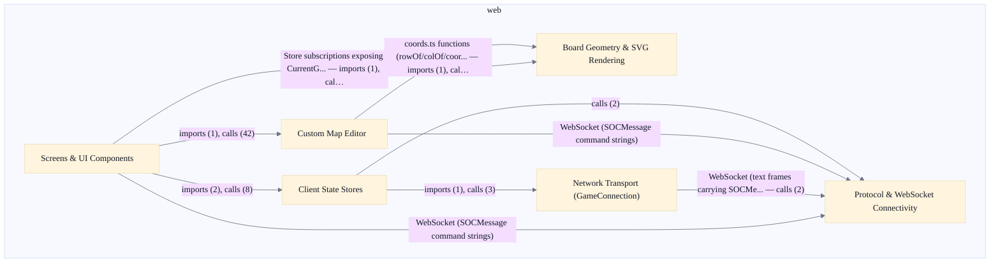

# Web Client & Board Rendering

## Overview
Server Protocol & WebSocket Connectivity: the browser client's protocol layer for the Java SOCServer wire protocol over WebSocket. Outbound, encode(msg) calls msg.toCmd() to produce one command string per text frame; inbound, decode(raw) splits on the SEP separator, reads the leading integer message-type id with Java-style decimal syntax and signed 32-bit range checks, looks it up in a module-level parser registry, and dispatches the data portion to the matching MessageParser. Key decisions: registry-based parser dispatch instead of a giant switch; fail-soft decode but fail-loud registration; stricter integer parsing than Number.parseInt; constants ported verbatim from Java rather than negotiated at runtime; a wire/ordinal split for seat-lock state. Board Geometry & SVG Rendering: the geometry-and-shape substrate beneath the in-game board. A SOCBoardLayout2 message is parsed into a render-friendly BoardModel (types.ts) of hexes, ports, robber/pirate positions and viewport dimensions, each element carrying a single packed 0xRRCC integer coordinate (row<<8 | col). The SVG renderer translates packed coordinates to pixel space via coords.ts. Key decisions: one integer-packed coordinate scheme shared by hexes/nodes/edges; pure functions with no React/store/network coupling; linear grid mapping plus a Y-parity slope drop rather than trigonometric hexagon math; hexPolygonPoints corners derived from the same node deltas pieces use; a hex-type to HexKind semantic indirection; presentation entirely via CSS custom properties and motion-suppression media queries. Screens, UI Components & Client State: inbound messages decoded by the net layer's GameConnection are dispatched into useGameStore, whose pure synchronous reducers fold them into connection status, the lobby list, registries, and the joined CurrentGame room (board, pieces, per-seat PlayerViews, inventory, trade and robber prompts, and Cities & Knights counters). React screens subscribe and render; outbound, UI interactions invoke action senders. Key decisions: client state split across three independent Zustand stores rather than one; action senders early-return instead of optimistically mutating local state; reducers pure and immutable with one changed object per update; settings derive DOM presentation through dedicated pure helpers. Custom Map Editor: turns a .map.json document into an editable in-memory CustomMap and back. On import, parseMapJson JSON-parses and fromRaw coerces into a CustomMap, keeping every hex/port coord as its original "0xRRCC" string so import->edit->export is byte-faithful; parseCoord/rowOf/colOf/coordOf translate the packed (row<<8)|col form on demand and encodeCoord re-serializes. Key decisions: keep coordinates as on-disk strings rather than parsing at import; house zero business validation in mapSchema.ts (only JSON<->model coercion and the coordinate codec); permissive GSON-mimicking deserialization in fromRaw; canonicalize land areas on export by grouping hexes by ascending area tag; normalize the import-only "3:1" port alias to canonical "misc" for new edits while still accepting it on import.

- [INV-CL-001: single-writer-next-landarea]
- [INV-CL-002: single-writer-desc-curstrvalue]
- [INV-CL-003: single-writer-parsed-boolvalue]
- [INV-CL-004: single-writer-parsed-intvalue]
- [INV-CL-005: single-writer-prevdicetotal-current]
- [INV-CL-006: single-writer-prevpiececount-current]
- [INV-CL-007: single-writer-prevmyturn-current]
- [INV-CL-008: single-writer-viewport-scrollleft]
- [INV-CL-009: single-writer-viewport-scrolltop]
- [INV-CL-010: single-writer-panref-current]
- …and 1 more (see [invariants/_scope.md](../invariants/_scope.md))

## Components
- **Protocol & WebSocket Connectivity**: Serialize SOCMessage objects to single-frame command strings and parse inbound frames by splitting on the SEP separator, reading the leading integer message-type id, and dispatching the remainder to the registered MessageParser; resolve game-option metadata via gameOptions.
- **Board Geometry & SVG Rendering**: Translate packed hex/node/edge coordinates into pixel geometry (hexToPixel, nodeToPixel, edgeToPixel, adjacency helpers, hexPolygonPoints) and render hexes, ports, pieces, and robber/pirate markers from a BoardModel.
- **Client State Stores**: Fold inbound messages into immutable state via pure reducers (applyElementAction, applyElementToView, deriveVp, updateView), expose action senders (playDevCard, pickMonopoly, playYearOfPlenty, ckKnightRequest) that early-return rather than optimistically mutate, and own connection orchestration (connectStore/reconnectStore).
- **Screens & UI Components**: Render UI from store subscriptions and translate user interactions into action-sender calls; the GameScreen drives in-game play (resourceCount, ck panel) and MapEditorScreen hosts the editor surface.
- **Custom Map Editor**: Coerce raw JSON into a CustomMap permissively (fromRaw, GSON-mimicking), round-trip it byte-faithfully (parseMapJson/serializeMapJson), canonicalize land areas and port aliases on export, clamp board geometry (clampBoardSize), and run client-side map validation.
- **Network Transport (GameConnection)**: Establish, hold, and tear down the browser WebSocket to the Java SOCServer, delivering raw frames to decode and writing encoded command strings back out.

## Boundaries
- **Protocol & WebSocket Connectivity** boundary: Owns the browser-side wire codec for the Java SOCServer protocol: the SOCMessage abstraction, the encode/decode pair, the module-level parser registry (registerParser/_clearParsersForTest), the per-message-type parser classes under web/src/protocol/messages, and the protocol constants ported from Java. The black-box edge is a raw WebSocket text frame on one side and a typed SOCMessage object on the other; it does not own the socket lifecycle (that is GameConnection) nor any game state. _[unverified: no imports/calls edge web/src/protocol/SOCMessage.ts::decode, web/src/protocol/SOCMessage.ts::encode, web/src/protocol/SOCMessage.ts::registerParser, web/src/protocol/messages/resourceSet.ts, web/src/protocol/messages/SOCScenarioInfo.ts -> GameConnection in code graph]_
- **Board Geometry & SVG Rendering** boundary: Owns the pure coordinate mathematics (coords.ts) and the SVG board view (BoardSVG.tsx and the piece components under web/src/board/pieces) plus the BoardModel/types and BoardSVG styling. The edge is a packed 0xRRCC integer coordinate (row<<8 | col) in, and pixel-space points / rendered SVG out; it has no React-store or network coupling at the coords layer. _[unverified: no imports/calls edge web/src/board/coords.ts::hexToPixel, web/src/board/coords.ts::getAdjacentNodesToHex, web/src/board/BoardSVG.tsx, web/src/board/pieces/HexTile.tsx, web/src/board/pieces/RobberPirate.tsx -> BoardSVG.tsx in code graph]_
- **Client State Stores** boundary: Owns the three independent Zustand stores: gameStore (connection status, lobby/game registries, the joined CurrentGame room with board, pieces, per-seat PlayerViews, inventory, trade/robber prompts, and Cities & Knights counters), settingsStore, and uiStore. The edge is decoded SOCMessage objects folded in by pure reducers and outbound action senders going out; it owns no DOM and no socket.
- **Screens & UI Components** boundary: Owns the connect/lobby/game/map-editor React screens (web/src/screens) and the shared presentational component barrel (web/src/components, including the Cities & Knights panel). The edge is store subscriptions in and user interactions out; screens hold no protocol or geometry logic of their own, delegating to the stores, the board renderer, and the editor.
- **Custom Map Editor** boundary: Owns the .map.json data layer and editing logic: the CustomMap typed model and JSON round-trip codec (mapSchema.ts), the editor action/grid/enhancement modules (editorActions.ts, editorGrid.ts, editorEnhancements.ts), client-side validation (validation.ts), and editor canvas/import-export components. The edge is .map.json text in/out and an editable in-memory CustomMap; coordinates are kept as on-disk "0xRRCC" strings and only translated to integers on demand. _[unverified: no imports/calls edge web/src/map-editor/mapSchema.ts::fromRaw, web/src/map-editor/mapSchema.ts::serializeMapJson, web/src/map-editor/editorGrid.ts::clampBoardSize, web/src/map-editor/editorActions.ts, web/src/map-editor/validation.ts -> editorActions.ts, web/src/map-editor/mapSchema.ts::fromRaw, web/src/map-editor/mapSchema.ts::serializeMapJson, web/src/map-editor/editorGrid.ts::clampBoardSize, web/src/map-editor/editorActions.ts, web/src/map-editor/validation.ts -> editorGrid.ts, web/src/map-editor/mapSchema.ts::fromRaw, web/src/map-editor/mapSchema.ts::serializeMapJson, web/src/map-editor/editorGrid.ts::clampBoardSize, web/src/map-editor/editorActions.ts, web/src/map-editor/validation.ts -> editorEnhancements.ts in code graph]_
- **Network Transport (GameConnection)** boundary: Owns the WebSocket socket lifecycle that sits between the protocol codec and the stores. The edge is connect/reconnect calls from gameStore on one side and raw text frames to/from the browser WebSocket on the other; it depends on the protocol codec to encode/decode but owns neither message semantics nor game state.

## Integration Points
- **SOCServer WebSocket protocol**: The browser client connects to the authoritative Java SOCServer over a WebSocket, carrying one existing SOCMessage command string per text frame. gameStore drives connectStore/reconnectStore through GameConnection, which writes encoded frames and feeds inbound frames into decode for reducer folding. The Java server remains authoritative for game state, rules, robots, scenarios, and final map validation. — see [Server & Message Protocol](../server-message-protocol/server-message-protocol.arch.md)
- **Game action dispatch to server**: In-game screens and the Cities & Knights panel translate user interactions into action-sender calls on gameStore (and editor actions during play), which serialize and send SOCMessage commands to the server's inbound message queue. This is the outbound game-action path observed in the code graph from GameScreen and the editor action layer. — see [Server & Message Protocol](../server-message-protocol/server-message-protocol.arch.md)
- **Server-side custom-map validation**: The map editor's client-side validation layer exercises the server's inbound message path for authoritative custom-map validation; the browser editor produces and edits .map.json but the Java server remains the final validator. Observed as validation.ts calling into the server inbound queue. — see [Server & Message Protocol](../server-message-protocol/server-message-protocol.arch.md)
- **Decoded message dispatch into stores**: Inbound frames decoded by the protocol codec are dispatched into gameStore's pure reducers, which fold them into connection status, registries, and the joined CurrentGame room. This is the internal seam between the protocol/transport layer and client state.
- **Store-driven rendering**: React screens and the board renderer subscribe to the Zustand stores and render from them; GameScreen reads gameStore directly and the board renderer consumes the store-held BoardModel. Outbound user interactions flow back through action senders.
- **Editor coordinate translation**: The map editor's action and grid layers reuse the board geometry coordinate codec to translate packed coordinates while editing, sharing the same 0xRRCC scheme used by the in-game board renderer rather than duplicating geometry math.

## Diagrams
### Architecture

## Source Linkage
- [Web client front end in web/ (TS/React 18/Zustand/Vite, SVG board)](../../../web/src/store/gameStore.ts)
- [WebSocket transport carrying one SOCMessage per frame](../../../web/src/protocol/SOCMessage.ts)
- [Protocol codec: encode/decode + parser registry](../../../web/src/protocol/SOCMessage.ts::decode)
- [Board coordinate codec (0xRRCC packed)](../../../web/src/board/coords.ts::hexToPixel)
- [Client state store (Zustand gameStore)](../../../web/src/store/gameStore.ts::connectStore)
- [Custom-map JSON codec](../../../web/src/map-editor/mapSchema.ts::fromRaw)
- [Network transport (GameConnection WebSocket)](../../../web/src/net/GameConnection.ts)
- [Map editor action layer](../../../web/src/map-editor/editorActions.ts)
- [Cities & Knights UI panel](../../../web/src/components/ck/CKPanel.tsx)
- [Web build/runtime config (React 18, Zustand 4.5, Vite 5, ports 8080/8888/8880)](../../../web/package.json)

Parent scope: [_scope.md](_scope.md)

## Source Linkage Grounding

_Per-row confidence; `_unverified_` rows are disclosed, not verified; `0.08 (resolved, uncited)` is the resolved-but-uncited baseline, not measured evidence._

| Element | Doc Evidence | Code Evidence | Confidence |
|---------|--------------|---------------|-----------:|
| Source Linkage: Web client front end in web/ (TS/React 18/Zustand/Vite, SVG board) | gameStore — Zustand store for connection + lobby state. | web/src/store/gameStore.ts | 0.75 |
| Source Linkage: WebSocket transport carrying one SOCMessage per frame | Base SOCMessage type, parser registry, and encode/decode helpers. | web/src/protocol/SOCMessage.ts | 0.75 |
| Source Linkage: Protocol codec: encode/decode + parser registry | Base SOCMessage type, parser registry, and encode/decode helpers. | web/src/protocol/SOCMessage.ts:79-112 | 0.75 |
| Source Linkage: Board coordinate codec (0xRRCC packed) |  | web/src/board/coords.ts:283-285 | 0.75 |
| Source Linkage: Client state store (Zustand gameStore) | gameStore — Zustand store for connection + lobby state. | web/src/store/gameStore.ts:2630-3051 | 0.75 |
| Source Linkage: Custom-map JSON codec |  | web/src/map-editor/mapSchema.ts:350-379 | 0.75 |
| Source Linkage: Network transport (GameConnection WebSocket) | GameConnection — browser WebSocket transport to the Java SOCServer. | web/src/net/GameConnection.ts | 0.83 |
| Source Linkage: Map editor action layer |  | web/src/map-editor/editorActions.ts | 0.75 |
| Source Linkage: Cities & Knights UI panel | Cities & Knights in-game UI: the local player's C&K panel (commodities, | web/src/components/ck/CKPanel.tsx | 0.72 |
| Source Linkage: Web build/runtime config (React 18, Zustand 4.5, Vite 5, ports 8080/8888/8880) |  | web/package.json | 0.08 (resolved, uncited) |

Related scopes: [Quality Infrastructure](../quality-infrastructure/quality-infrastructure.arch.md), [Web Protocol & Map Editor](../web-protocol-map-editor/web-protocol-map-editor.arch.md)
