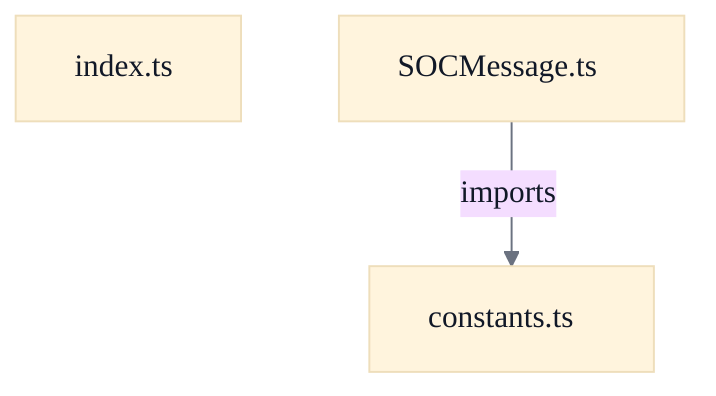

# TypeScript SOCMessage Protocol Layer

## Strategic Context
- **Browser-client interop over WebSocket** — constants.ts's header states these values exist 'so the TypeScript client can interoperate over WebSocket' with the Java SOCServer, each frame carrying one `toCmd()` string (per web/docs/MIGRATION_SPEC.md section 2). The protocol layer is the foundation of the web port: it lets a fresh React/TypeScript client reuse the existing Java server unchanged rather than re-implementing game logic.
- **Cross-language source-of-truth discipline** — The code repeatedly anchors itself to the Java source ('Keep these values in sync with src/main/java/soc/message/SOCMessage.java', 'Verified against SOCGameOption.java'), and even corrects a misnamed codepoint in the Java comment. The distinctive rationale here is that Java remains the protocol's authority and the TypeScript port is a tracked mirror, not an independent definition.

## Overview
This module re-implements the Java SOCMessage string wire protocol in TypeScript so the browser client speaks the exact SEP-delimited unicode-string format the Java `SOCServer` uses, one `toCmd()` string per WebSocket text frame. Outbound, `encode(msg)` is a thin wrapper returning `msg.toCmd()`. Inbound, `decode(raw)` reads the integer type id up to the first `SEP`, validates it with `parseJavaInt` for Java-style decimal syntax and 32-bit signed range, looks the id up in the module-level `parserRegistry`, and hands the remaining data portion to the matched parser — returning `null` for an unknown id or any parser error, just as Java's `toMsg` ignores unrecognized types. Per-type parsers self-register at import time via `registerParser`, and `constants.ts` supplies the shared numeric ordinals all message modules reference.

## Components
- **SOCMessage.ts** (referenced; defined externally)
- **constants.ts** (referenced; defined externally)
- **index.ts** (referenced; defined externally)
- **parserRegistry** (referenced; defined externally)

## Connections
- **constants.ts** (outbound) — via `import { SEP } from './constants'` in SOCMessage.ts (evidence: web/src/protocol/SOCMessage.ts top-level import; diagram_dependency edge SOCMessage.ts --imports--> constants.ts)
- **Ported message modules (web/src/protocol/messages/*.ts)** (inbound) — via each module calls `registerParser(type, parser)` on import; index.ts re-exports them to trigger that side-effect (evidence: web/src/protocol/index.ts — 'Each self-registers its parser on import' re-export block)
- **Java SOCServer** (bidirectional) — via SEP-delimited `toCmd()` strings over WebSocket text frames (web/docs/MIGRATION_SPEC.md section 2) (evidence: web/src/protocol/constants.ts header comment 'so the TypeScript client can interoperate over WebSocket')

## Design Decisions
- **Port the Java string wire format verbatim instead of inventing a binary or JSON protocol**: The browser client must interoperate with the unmodified Java `SOCServer`; constants.ts states the values 'mirror the exact wire-format tokens and message-type IDs used by the Java SOCServer so the TypeScript client can interoperate over WebSocket' with one `toCmd()` string per frame. Keeping byte-for-byte parity is the whole point — encode is therefore just a `toCmd()` pass-through with no transformation.
- **Self-registering parser registry keyed by type id, rather than a central switch statement**: Mirrors Java's `SOCMessage.toMsg` switch while keeping each message module self-contained: a module registers its own parser on import, and `decode` only knows the `Map`. The cost is reliance on import side-effects — `index.ts` must re-export every message module so its `registerParser()` runs; this is documented as a deliberate contract in index.ts's header comment.
- **`decode` returns `null` (never throws) on unknown or malformed input**: Faithful to Java's `toMsg`, which wraps parsing in try/catch and silently ignores unknown types. The parser call is wrapped in try/catch and an absent registry entry returns `null`, so a single bad frame can't crash the client's receive loop.
- **Reject protocol integer tokens with a Java-int parser instead of trusting JS `Number.parseInt`**: JS `Number.parseInt` is lenient ('1083abc' → 1083) and does not enforce Java's 32-bit signed integer range, whereas Java `Integer.parseInt` rejects malformed or out-of-range tokens. `parseJavaInt` applies the decimal-token guard plus `-2147483648..2147483647` range checks for the core type id and per-message decimal field helpers, so the two implementations agree on which frames are valid — a cross-language fidelity concern, not a style choice.
- **`const` objects with derived literal-union types instead of TypeScript `enum`s**: Lets message modules reference shared numeric ordinals (e.g. `MessageType.VERSION`) rather than magic numbers, while the `(typeof X)[keyof typeof X]` pattern yields a precise union type. Plain const objects also keep the values byte-identical to the Java ordinals and avoid `enum` runtime quirks. Comments flag where ordinals differ from the wire encoding (e.g. `SeatLockState` ordinals vs. the `SeatLockWire` 'true'/'false'/'clear' strings).

## Constraints
- **[UNVERIFIED]** `registerParser` MUST throw on a duplicate registration for the same message-type id. — web/src/protocol/SOCMessage.ts::registerParser — `if (parserRegistry.has(type)) { throw new Error(...) }` (cross-document reconciliation: not verified against `web/src/protocol/SOCMessage.ts`; recorded as design intent, not current code fact.)
- **[UNVERIFIED]** `decode` MUST reject any type token that Java's `Integer.parseInt` would reject (optional leading +/- then digits only, within signed 32-bit integer range) before dispatching. — web/src/protocol/SOCMessage.ts::decode; web/src/protocol/javaInt.ts::parseJavaInt — `const type = parseJavaInt(typeStr); if (type === null) return null;` (cross-document reconciliation: not verified against `web/src/protocol/SOCMessage.ts`; recorded as design intent, not current code fact.)
- **[UNVERIFIED]** `decode` MUST return `null` (not throw) for an unknown type id or a parser error, matching Java `toMsg`'s ignore-on-failure behavior. — web/src/protocol/SOCMessage.ts::decode — `parser === undefined` returns null; parser call wrapped in `try { ... } catch { return null; }` (cross-document reconciliation: not verified against `web/src/protocol/SOCMessage.ts`; recorded as design intent, not current code fact.)
- **[SOFT]** Protocol constant values SHOULD stay in sync with `src/main/java/soc/message/SOCMessage.java` and `SOCGameOption.java`. — web/src/protocol/constants.ts header comment 'Keep these values in sync with src/main/java/soc/message/SOCMessage.java'

## Non-Functional Requirements
- **reliability** — A malformed or unknown wire frame must not crash the receive path; decode degrades to `null` via try/catch and registry-miss handling. — web/src/protocol/SOCMessage.ts::decode
- **error-handling** — Accidental duplicate parser registration is surfaced immediately as a thrown Error rather than silently overwriting an existing parser. — web/src/protocol/SOCMessage.ts::registerParser
- **interoperability** — Type-id parsing must match Java `Integer.parseInt` semantics so client and server agree on which frames are valid; enforced by `parseJavaInt` syntax and 32-bit range checks. — web/src/protocol/SOCMessage.ts::decode; web/src/protocol/javaInt.ts::parseJavaInt

## Examples
*Shows the defensive parse-and-validate that keeps decode aligned with Java's stricter integer parsing.*
*Source: `web/src/protocol/SOCMessage.ts::decode`*
```
const type = parseJavaInt(typeStr);
  if (type === null) {
    return null;
  }
```

*Illustrates the fail-fast guard against accidental double-registration in the self-registering dispatch design.*
*Source: `web/src/protocol/SOCMessage.ts::registerParser`*
```
if (parserRegistry.has(type)) {
    throw new Error(`Duplicate parser registration for message type ${type}`);
  }
  parserRegistry.set(type, parser);
```

## Diagrams
### Dependency



## Source Linkage
- [encode serializes via toCmd](../../../web/src/protocol/SOCMessage.ts::encode)
- [decode reads type id from first SEP token, validates as integer, and dispatches to registered parser](../../../web/src/protocol/SOCMessage.ts::decode)
- [Java-compatible integer parser for protocol tokens](../../../web/src/protocol/javaInt.ts::parseJavaInt)
- [registerParser self-registration, throws on duplicate](../../../web/src/protocol/SOCMessage.ts::registerParser)
- [_clearParsersForTest resets registry between tests (not in package index)](../../../web/src/protocol/SOCMessage.ts::_clearParsersForTest)
- [MessageParser type alias and SOCMessage interface](../../../web/src/protocol/SOCMessage.ts::MessageParser)
- [Message-type and protocol constants mirror Java enumerations](../../../web/src/protocol/constants.ts::MessageType)
- [OptionType / OptionFlag tables verified against SOCGameOption.java](../../../web/src/protocol/constants.ts::OptionType)
- [Public protocol surface and side-effecting parser registration](../../../web/src/protocol/index.ts)
- [Web package build/runtime config (TypeScript strict, vite, vitest, ws)](../../../web/package.json)

Parent scope: [_scope.md](_scope.md)
Sibling feature: [typescript-socmessage-protocol-layer.feature.md](typescript-socmessage-protocol-layer.feature.md)
Scope architecture: [web-protocol-map-editor.arch.md](web-protocol-map-editor.arch.md)

## Source Linkage Grounding

_Per-row confidence; `_unverified_` rows are disclosed, not verified; `0.08 (resolved, uncited)` is the resolved-but-uncited baseline, not measured evidence._

| Element | Doc Evidence | Code Evidence | Confidence |
|---------|--------------|---------------|-----------:|
| Source Linkage: encode serializes via toCmd | Base SOCMessage type, parser registry, and encode/decode helpers. | web/src/protocol/SOCMessage.ts:64-66 | 0.75 |
| Source Linkage: decode reads type id from first SEP token, validates as integer, and dispatches to registered parser | Base SOCMessage type, parser registry, and encode/decode helpers. | web/src/protocol/SOCMessage.ts:79-112 | 0.75 |
| Source Linkage: Java-compatible integer parser for protocol tokens | Java-style decimal syntax and 32-bit signed range validation for TypeScript protocol parsing. | web/src/protocol/javaInt.ts | 0.75 |
| Source Linkage: registerParser self-registration, throws on duplicate | Base SOCMessage type, parser registry, and encode/decode helpers. | web/src/protocol/SOCMessage.ts:50-55 | 0.75 |
| Source Linkage: _clearParsersForTest resets registry between tests (not in package index) | Base SOCMessage type, parser registry, and encode/decode helpers. | web/src/protocol/SOCMessage.ts:118-120 | 0.75 |
| Source Linkage: MessageParser type alias and SOCMessage interface | Base SOCMessage type, parser registry, and encode/decode helpers. | web/src/protocol/SOCMessage.ts:34-34 | 0.75 |
| Source Linkage: Message-type and protocol constants mirror Java enumerations | Protocol constants ported from soc.message.SOCMessage (Java). | web/src/protocol/constants.ts:39-196 | 0.83 |
| Source Linkage: OptionType / OptionFlag tables verified against SOCGameOption.java | Protocol constants ported from soc.message.SOCMessage (Java). | web/src/protocol/constants.ts:321-338 | 0.83 |
| Source Linkage: Public protocol surface and side-effecting parser registration | Public surface of the protocol core. | web/src/protocol/index.ts | 0.75 |
| Source Linkage: Web package build/runtime config (TypeScript strict, vite, vitest, ws) |  | web/package.json | 0.08 (resolved, uncited) |

Related scopes: [Quality Infrastructure](../quality-infrastructure/quality-infrastructure.arch.md), [Web Client & Board Rendering](../web-client-board-rendering/web-client-board-rendering.arch.md)
