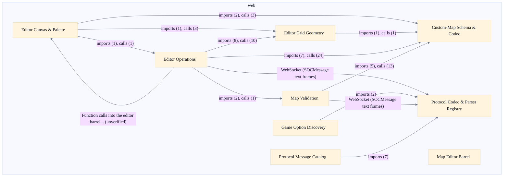

# Web Protocol & Map Editor

## Strategic Context
- **Protocol parity over reinvention** — Per Readme.md, the web client re-implements the Java SOCMessage string wire format verbatim — one existing SOCMessage string per WebSocket text frame — specifically so the authoritative SOCServer, the rules engine, and the robot subsystem stay unchanged and only the front end is replaced. A binary or JSON protocol was deliberately not introduced; the distinctive constraint of this scope is byte-for-byte fidelity to a wire format owned by another epic.
- **Custom maps as server-loadable scenarios** — Per doc/Custom-Maps.md, the in-browser editor targets the same *.map.json structure the server loads at startup and registers as custom scenarios, so a layout authored in the browser is playable by any current client without client-specific support. This is why mapSchema mirrors the Java CustomMapLoader's GSON-permissive deserialization rather than defining its own model — the on-disk document, not the editor, is the integration contract.

- [INV-CL-001: single-writer-next-landarea]
- [INV-CL-002: single-writer-desc-curstrvalue]
- [INV-CL-003: single-writer-parsed-boolvalue]
- [INV-CL-004: single-writer-parsed-intvalue]
- [INV-CL-005: single-writer-prevdicetotal-current]
- [INV-CL-006: single-writer-prevpiececount-current]
- [INV-CL-007: single-writer-prevmyturn-current]
- [INV-CL-008: single-writer-viewport-scrollleft]
- [INV-CL-009: single-writer-viewport-scrolltop]
- [INV-CL-010: single-writer-panref-current]
- …and 1 more (see [invariants/_scope.md](../invariants/_scope.md))

## Overview
TypeScript SOCMessage Protocol Layer (web/src/protocol): re-implements the Java SOCMessage string wire protocol in TypeScript so the browser speaks the exact SEP-delimited unicode-string format the Java SOCServer uses, one toCmd() string per WebSocket text frame. encode(msg) is a thin wrapper over msg.toCmd(); decode(raw) reads the type id to the first SEP, parses it with a Java-compatible integer helper (strict decimal syntax plus 32-bit signed range), looks it up in a self-registering parserRegistry keyed by type id, and returns null (never throws) on unknown/malformed input. Decisions: port the Java format verbatim rather than invent a binary/JSON protocol; registry over a central switch; const objects with derived literal-union types instead of enums. Custom Map Editor Canvas & Palette (web/src/map-editor/components): authoring splits into two stateless presentational components driven by a parent screen owning the single CustomMap. EditorPalette selects the active EditorTool and paint parameters (hex type, dice number, land area, port type/facing) and emits metadata edits via callbacks; EditorCanvas reads the same CustomMap, memo-indexes placed hexes and ports by integer 0xRRCC coordinate, enumerates the fixed grid via editorGrid, and renders each cell with HexCell. Decisions: pure/presentational with all state lifted; reuse in-game board geometry (coords.ts, board defs/textures) read-only; normalize loose map-type strings through a closed motif set with an 'unknown' fallback; memo-index and memoize grid/viewBox derivations; expose the data layer through one barrel module. Map Schema & Custom-Map JSON Model (web/src/map-editor/mapSchema.ts): the data-model spine. Repository evidence: `web/src/map-editor/mapSchema.ts`, `web/src/protocol/messages/SOCJoinGameAuth.ts`. Repository evidence: `web/src/map-editor/mapSchema.ts`.

## Components
- **Protocol Codec & Parser Registry**: Serialize outbound model messages to SEP-delimited unicode strings and parse one inbound WebSocket text frame into a typed message object.
- **Protocol Message Catalog**: Define the field-level layout and parser for every supported SOCMessage type and register it with the codec.
- **Game Option Discovery**: Parse and represent server-advertised game options/scenarios for the client connection layer.
- **Custom-Map Schema & Codec**: Own the in-memory CustomMap model and the bidirectional codec between .map.json text and that model.
- **Editor Operations**: Apply paint/edit/enhancement operations as pure functions over the CustomMap model.
- **Editor Grid Geometry**: Provide the cell enumeration and coordinate/size geometry the canvas and operations draw against.
- **Editor Canvas & Palette**: Render the authoring surface and translate user clicks/tool selection into edit callbacks; hold no authoritative state.
- **Map Validation**: Gate a CustomMap as structurally valid before export/use.
- **Map Editor Barrel**: Publish the editor data layer's public API.

## Boundaries
- **Protocol Codec & Parser Registry** boundary: Owns the encode/decode spine of the browser wire layer: encode(msg) returns msg.toCmd(); decode(raw) reads the integer type id up to the first SEP, validates it through a Java-compatible parser (rather than trusting JS Number.parseInt), looks it up in a module-level self-registering parserRegistry keyed by type id, and dispatches. decode never throws — it returns null on unknown or malformed input. Does NOT own per-message field semantics; those live in the Message Catalog.
- **Protocol Message Catalog** boundary: Owns one TypeScript class per SOCMessage type — including the high-centrality SOCScenarioInfo, SOCSetSeatLock, and SOCStatusMessage — plus the shared resourceSet encoder reused by resource-bearing trade/pick messages (SOCAcceptOffer, SOCBankTrade, SOCMakeOffer, SOCPickResources). Each class self-registers its parser into the registry and implements toCmd(); decimal integer field helpers delegate to the shared Java-compatible parser so malformed and out-of-range values match Java Integer.parseInt behavior. The catalog is the black box for each message type's field layout.
- **Game Option Discovery** boundary: web/src/protocol/gameOptions.ts — owns the TypeScript representation and parsing of the server's game-option / scenario discovery used by the client to negotiate game options before joining. Boundary edge is the parsed option model; does not own the connection or store state that drives discovery.
- **Custom-Map Schema & Codec** boundary: web/src/map-editor/mapSchema.ts — the data-model spine. Repository evidence: `web/src/map-editor/mapSchema.ts`, `web/src/protocol/messages/SOCJoinGameAuth.ts`. Coordinates are kept as on-disk "0xRRCC" strings inside the model rather than parsed to ints at load. _[unverified: no imports/calls edge web/src/map-editor/mapSchema.ts -> CustomMapLoader in code graph]_
- **Editor Operations** boundary: web/src/map-editor/editorActions.ts and web/src/map-editor/editorEnhancements.ts — stateless transformations that take a CustomMap plus a tool action and return a new CustomMap; editorEnhancements layers higher-level composite operations on top of editorActions. No UI state is held here; all editor state is owned by the parent screen.
- **Editor Grid Geometry** boundary: web/src/map-editor/editorGrid.ts — enumerates the fixed sea-board authoring grid, clamps requested board dimensions (clampBoardSize), and maps grid cells to integer 0xRRCC coordinates. Consumes in-game board geometry read-only rather than reimplementing it.
- **Editor Canvas & Palette** boundary: web/src/map-editor/components/* (EditorCanvas, EditorPalette, HexCell, ImportExportPanel) — pure presentational components with all state lifted to the parent screen. EditorPalette selects the active EditorTool and paint parameters (hex type, dice number, land area, port type/facing) and emits edits via callbacks; EditorCanvas reads the same CustomMap, memo-indexes placed hexes and ports by integer 0xRRCC coordinate, enumerates the grid via editorGrid, and renders each cell with HexCell. Cross-document reconciliation verified `web/src/map-editor/components/EditorCanvas.tsx`: the previously-disclaimed behavior is present in the retrieved code.
- **Map Validation** boundary: web/src/map-editor/validation.ts — validates a CustomMap against the schema's structural rules (via mapSchema) before a map is exported or offered to the server. Owns the validation rule set; does not own the model definition.
- **Map Editor Barrel** boundary: web/src/map-editor/index.ts — single public surface exposing the editor data layer (schema, operations, grid, validation) to consuming screens, so callers depend on one module rather than reaching into internals.

## Integration Points
- **Editor edits flow to server inbound queue**: Editor Operations ultimately drive messages into the authoritative server. The code graph reports editorActions.ts calling the server's InboundMessageQueue (x7); the realized mechanism is the SOCMessage WebSocket protocol plus the server's CustomMapLoader reading the authored *.map.json at startup (per doc/Custom-Maps.md). — see [Game Model & Rules Engine](../game-model-rules-engine/game-model-rules-engine.arch.md)
- **Validation gate to server inbound queue**: Map Validation is reported by the code graph as the heaviest TS->server edge (validation.ts -> InboundMessageQueue, x23), corresponding to validated maps/messages being admitted to the server runtime over the WebSocket protocol. — see [Game Model & Rules Engine](../game-model-rules-engine/game-model-rules-engine.arch.md)
- **Map editor data layer driven by editor screen**: The MapEditorScreen (sibling Web Client epic) owns editor state and drives this epic's data layer: it calls editorActions (x27), mapSchema (x10), editorEnhancements (x5), and editorGrid (x4). All authoring state lives in the screen; this epic supplies pure operations and the model. _[unverified: no imports/calls edge web/src/screens/MapEditorScreen.tsx -> web/src/map-editor/editorActions.ts -> web/src/screens/MapEditorScreen.tsx in code graph]_ — see [Web Client & Board Rendering](../web-client-board-rendering/web-client-board-rendering.arch.md)
- **Board geometry reuse**: Editor Grid Geometry, Editor Operations, and Editor Canvas consume the in-game board coordinate helpers read-only (editorActions x4, editorGrid x3, EditorCanvas x2 against coords.ts) instead of reimplementing hex geometry. — see [Web Client & Board Rendering](../web-client-board-rendering/web-client-board-rendering.arch.md)
- **Game option discovery consumed by game store**: The Zustand game store reads this epic's Game Option Discovery to negotiate options on connect (gameStore.ts -> gameOptions.ts, x3). The store also consumes the protocol codec to serialize/parse frames over its WebSocket connection. _[unverified: no imports/calls edge web/src/store/gameStore.ts -> web/src/protocol/gameOptions.ts -> web/src/store/gameStore.ts::connectStore in code graph]_ — see [Web Client & Board Rendering](../web-client-board-rendering/web-client-board-rendering.arch.md)

## Diagrams
### Architecture

## Source Linkage
- [Protocol Codec & Parser Registry](../../../web/src/protocol/SOCMessage.ts)
- [Java-compatible protocol integer parser](../../../web/src/protocol/javaInt.ts)
- [Protocol type-id constants](../../../web/src/protocol/constants.ts)
- [Protocol public barrel](../../../web/src/protocol/index.ts)
- [SOCScenarioInfo message](../../../web/src/protocol/messages/SOCScenarioInfo.ts::SOCScenarioInfo)
- [SOCSetSeatLock message](../../../web/src/protocol/messages/SOCSetSeatLock.ts::SOCSetSeatLock)
- [SOCStatusMessage message](../../../web/src/protocol/messages/SOCStatusMessage.ts::SOCStatusMessage)
- [resourceSet shared encoder](../../../web/src/protocol/messages/resourceSet.ts)
- [Game Option Discovery](../../../web/src/protocol/gameOptions.ts)
- [Custom-Map Schema & Codec](../../../web/src/map-editor/mapSchema.ts)
- [Editor Operations (actions)](../../../web/src/map-editor/editorActions.ts)
- [Editor Operations (enhancements)](../../../web/src/map-editor/editorEnhancements.ts)
- [Editor Grid Geometry](../../../web/src/map-editor/editorGrid.ts::clampBoardSize)
- [Editor Canvas](../../../web/src/map-editor/components/EditorCanvas.tsx)
- [Editor Palette](../../../web/src/map-editor/components/EditorPalette.tsx)
- [Map Validation](../../../web/src/map-editor/validation.ts)
- [Map Editor Barrel](../../../web/src/map-editor/index.ts)
- [Server inbound queue (cross-epic target)](../../../src/main/java/soc/server/genericServer/InboundMessageQueue.java::InboundMessageQueue.push)
- [Web client build/runtime config](../../../web/package.json)

Parent scope: [_scope.md](_scope.md)

## Source Linkage Grounding

_Per-row confidence; `_unverified_` rows are disclosed, not verified; `0.08 (resolved, uncited)` is the resolved-but-uncited baseline, not measured evidence._

| Element | Doc Evidence | Code Evidence | Confidence |
|---------|--------------|---------------|-----------:|
| Source Linkage: Protocol Codec & Parser Registry | Base SOCMessage type, parser registry, and encode/decode helpers. | web/src/protocol/SOCMessage.ts | 0.75 |
| Source Linkage: Protocol type-id constants | Protocol constants ported from soc.message.SOCMessage (Java). | web/src/protocol/constants.ts | 0.83 |
| Source Linkage: Protocol public barrel | Public surface of the protocol core. | web/src/protocol/index.ts | 0.75 |
| Source Linkage: SOCScenarioInfo message | SOCScenarioInfo — scenario info request (client) / reply (server). | web/src/protocol/messages/SOCScenarioInfo.ts:66-318 | 0.95 |
| Source Linkage: SOCSetSeatLock message | SOCSetSeatLock — set the lock state of one seat, or all seats at once. | web/src/protocol/messages/SOCSetSeatLock.ts:42-162 | 0.51 |
| Source Linkage: SOCStatusMessage message | SOCStatusMessage — status text shown in the client's main window, with an | web/src/protocol/messages/SOCStatusMessage.ts:16-81 | 0.19 |
| Source Linkage: resourceSet shared encoder | Shared resource-set encoding helpers for the trade / pick / robbery messages. | web/src/protocol/messages/resourceSet.ts | 0.75 |
| Source Linkage: Game Option Discovery | Shared game-option descriptor types + protocol (de)serialization. | web/src/protocol/gameOptions.ts | 0.75 |
| Source Linkage: Custom-Map Schema & Codec |  | web/src/map-editor/mapSchema.ts | 0.75 |
| Source Linkage: Editor Operations (actions) |  | web/src/map-editor/editorActions.ts | 0.75 |
| Source Linkage: Editor Operations (enhancements) |  | web/src/map-editor/editorEnhancements.ts | 0.75 |
| Source Linkage: Editor Grid Geometry |  | web/src/map-editor/editorGrid.ts:61-66 | 0.75 |
| Source Linkage: Editor Canvas |  | web/src/map-editor/components/EditorCanvas.tsx | 0.32 |
| Source Linkage: Editor Palette | Hex-type -> swatch fill CSS variable, matching the canvas/board theme tokens. */ | web/src/map-editor/components/EditorPalette.tsx | 0.24 |
| Source Linkage: Map Validation |  | web/src/map-editor/validation.ts | 0.75 |
| Source Linkage: Map Editor Barrel | Public surface of the custom-map editor data layer (schema, validation, preview). */ | web/src/map-editor/index.ts | 0.16 |
| Source Linkage: Server inbound queue (cross-epic target) |  | src/main/java/soc/server/genericServer/InboundMessageQueue.java:126-134 | 0.75 |
| Source Linkage: Web client build/runtime config |  | web/package.json | 0.08 (resolved, uncited) |

Related scopes: [Desktop Swing Client](../desktop-swing-client/desktop-swing-client.arch.md), [Game Model & Rules Engine](../game-model-rules-engine/game-model-rules-engine.arch.md), [Optional Database](../optional-database/optional-database.arch.md), [Quality Infrastructure](../quality-infrastructure/quality-infrastructure.arch.md), [Robot / AI Players](../robot-ai-players/robot-ai-players.arch.md), [Server & Message Protocol](../server-message-protocol/server-message-protocol.arch.md), [Web Client & Board Rendering](../web-client-board-rendering/web-client-board-rendering.arch.md)

## Contract Gaps Detected

| File | Declared Field | Accepting Function | Gap |
|------|----------------|--------------------|-----|
| `web/src/map-editor/validation.ts` | `ValidationIssue.message` | `validateSortRankPrefix(issues: ValidationIssue)` | No same-file read of `issues.message` was detected; document it as declared intent, not enforced behavior. |
| `web/src/map-editor/validation.ts` | `ValidationIssue.message` | `validateDescription(issues: ValidationIssue)` | No same-file read of `issues.message` was detected; document it as declared intent, not enforced behavior. |
| `web/src/map-editor/validation.ts` | `ValidationIssue.message` | `validatePlayerCounts(issues: ValidationIssue)` | No same-file read of `issues.message` was detected; document it as declared intent, not enforced behavior. |
| `web/src/map-editor/validation.ts` | `ValidationIssue.message` | `validateBoardDimension(issues: ValidationIssue)` | No same-file read of `issues.message` was detected; document it as declared intent, not enforced behavior. |
| `web/src/map-editor/validation.ts` | `ValidationIssue.message` | `validateHexDiceNum(issues: ValidationIssue)` | No same-file read of `issues.message` was detected; document it as declared intent, not enforced behavior. |
| `web/src/map-editor/validation.ts` | `ValidationIssue.message` | `validateLandAreas(issues: ValidationIssue)` | No same-file read of `issues.message` was detected; document it as declared intent, not enforced behavior. |
| `web/src/map-editor/validation.ts` | `ValidationIssue.message` | `checkPortFacingGeometry(issues: ValidationIssue)` | No same-file read of `issues.message` was detected; document it as declared intent, not enforced behavior. |
| `web/src/map-editor/validation.ts` | `ValidationIssue.message` | `checkPortFacesLand(issues: ValidationIssue)` | No same-file read of `issues.message` was detected; document it as declared intent, not enforced behavior. |
